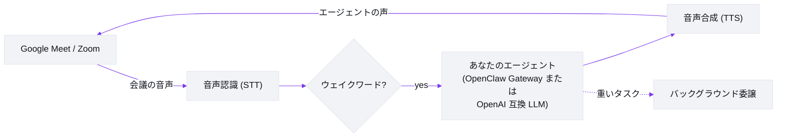

# Meetmate

[English](README.md) | **日本語** | [中文](README.zh.md) | [ไทย](README.th.md)

> この文書は [README.md](README.md)（英語・正本）の翻訳です。内容に乖離がある場合は英語版が優先されます。

[](https://github.com/caty-ai/meetmate/actions/workflows/test.yml)
[](LICENSE)
[](https://nodejs.org/)
[](#何ができるのか)
[](#30秒で試す)

<picture>
  <source media="(prefers-color-scheme: dark)" srcset="docs/images/hero-dark.svg">
  
</picture>

**あなたのAIエージェントを、Google Meet にも Zoom にも。声で話せる、本物の参加者として。**

Meetmate がやることはひとつだけ。**あなたの**エージェントに、会議の席を用意することです。顔と声を持った参加者として入室し、名前を呼べば答え、頼めばやってくれる。あえてそれ以上のことはせず、そのひとつを徹底的に磨きました。

## 何ができるのか

- **議事録ボットではなく、参加者です。** 参加者グリッドに自分のアバターで並び、部屋の会話を聞き、声で話します。ウェイクワード検出とバージイン対応（話しかぶせると、ちゃんと黙ります）。
- **「あなたの」エージェントが来ます。** ふだん使っているエージェントを、記憶も性格もスキルもそのままに接続（OpenClaw Gateway 経由）。チームが知っている「いつものあの子」が、そのまま会議室に入ってくる。だから Meetmate は一台ごとに個性が違います。（Gateway がなくても、任意の OpenAI 互換エンドポイントで動きます — 素の LLM+組み込みペルソナのシンプル構成。詳細は [LLM providers](docs/TECHNICAL.md#llm-providers)）
- **その場で頼めます。** 「今の議論まとめてチャンネルに投稿しといて」——重い作業は自動でバックグラウンドのセッションに委譲されるので、エージェントは会話に残ったままタスクが進みます。
- **「普通にできる」が製品です。** プッシュトゥトーク不要、特別なコマンド不要、気まずい沈黙もなし。同僚に話しかけるのと同じように話す——それが当たり前に感じられることこそ、磨いた部分です。
- **会議はどこでも、サーバーもどこでも。** 会議側は Google Meet と Zoom、サーバー側は Windows / macOS / Linux。設定ファイルと API キーを用意して、コマンド1発（アバター画像はお好みで差し替え可能）。

> 📸 実際の会議に参加しているスクリーンショットとデモ GIF は準備中です。

## 30秒で試す

> ℹ️ npm 初回リリース公開までは、下の[ソースから起動](#ソースから起動)を使ってください。

```bash
mkdir my-agent && cd my-agent
npm install meetmate
npx meetmate init     # 3つの API キーを聞かれ、config.json と .env が作られ、次の手順が表示されます
npx meetmate start    # サーバーが起動し、設定 UI の URL が表示されます
```

http://localhost:5005 を開いて Meet / Zoom の URL を貼り、**Join** を押せば、あなたのエージェントが会議に参加します。ウェイクワードで呼んで、話し始めてください。

前提条件（Node.js ≥ 26、[Attendee](https://attendee.dev/)・[Soniox](https://soniox.com/)・[Fish Audio](https://fish.audio/) の API キー）は[セットアップガイド](docs/setup-guide.md)が一歩ずつ案内します。

### ソースから起動

```bash
git clone git@github.com:caty-ai/meetmate.git
cd meetmate
npm install
cp .env.example .env && cp config.json.example config.json   # キーを記入
npm start
```

## なぜ作ったのか

会議は、人間が実際に協働する場所です。決定も、ニュアンスも、声のトーンも、「あ、あとひとつだけ」の瞬間も、全部そこにある。あなたのエージェントがチャット欄の中にしかいないなら、それらを全部見逃していることになります。

私たちは、エージェントは人間と同じ場所に座るべきだと考えています。通話の隅にいる文字起こしボットとしてではなく、グリッドの中の同僚として——そこにいて、呼びかけられて、役に立つ存在として。そして来るのが「あなたの」エージェントである以上、記憶も性格もその子のものです。「AIが会議に入った」と「**あの子**が会議に入った」の違いは、そこから生まれます。

Meetmate は意図的に小さな道具です。会議の進行を仕切ったりはしないし、商談を採点したりも、カレンダーの代わりになろうともしません。あなたのエージェントを部屋に連れて行く。その先は、あなたとその子の話です。

## 仕組み



1エージェント = 1サーバーインスタンス。サーバーが会議の音声を音声パイプライン（音声認識 → あなたのエージェントの LLM → 音声合成）へ橋渡しし、返答を通話へストリームで返します——会話として成立する速さで。

アーキテクチャ・モジュール構成・プロバイダ・音声仕様などの技術詳細は [docs/TECHNICAL.md](docs/TECHNICAL.md) にまとまっています。

## 設定

よくある調整の入口です。完全なリファレンスは [docs/operations.md](docs/operations.md) へ。

| やりたいこと | 見る場所 |
|---|---|
| 自分のエージェントをつなぐ（OpenClaw Gateway） | [セットアップガイド](docs/setup-guide.md) |
| 汎用の OpenAI 互換エンドポイントを使う | [TECHNICAL.md — LLM providers](docs/TECHNICAL.md#llm-providers) |
| 返答をもっと速くする | [Soniox チューニング](docs/operations.md#stt-プロバイダ切替soniox-チューニング) |
| 声・話速・TTS の挙動を変える | [音声プロファイル](docs/operations.md#音声プロファイルtts) |
| 重い作業をバックグラウンド委譲する | [委譲ハーネス](docs/operations.md#委譲強制ハーネス79) |
| 調子が悪いとき前の設定に戻す | [緊急 rollback 用 env](docs/operations.md#緊急-rollback-用-env) |
| Claude Code から会議を操作する（MCP） | [TECHNICAL.md — MCP server](docs/TECHNICAL.md#mcp-server-control-plane) |

うまく動かないときは[トラブルシューティング](docs/TECHNICAL.md#troubleshooting)へ。

## ドキュメント

| ドキュメント | 内容 |
|---|---|
| [docs/setup-guide.md](docs/setup-guide.md) | ゼロから初会議までのセットアップ手順 |
| [docs/TECHNICAL.md](docs/TECHNICAL.md) | 機能詳細・アーキテクチャ・プロバイダ・MCP・開発 |
| [docs/architecture.md](docs/architecture.md) | アーキテクチャ詳説 |
| [docs/operations.md](docs/operations.md) | 運用・チューニング完全リファレンス |
| [docs/deploy-checklist.md](docs/deploy-checklist.md) | デプロイチェックリスト |

## 開発ステータス

- **リリース**: 公開バージョンは [GitHub Releases](https://github.com/caty-ai/meetmate/releases) を参照してください。
- **進行中**: npm 配布・公開リリーストラック（[#136](https://github.com/caty-ai/meetmate/issues/136) / [#107](https://github.com/caty-ai/meetmate/issues/107)）

## コントリビュート

Issue・PR 歓迎です — [CONTRIBUTING.md](CONTRIBUTING.md) をご覧ください。Issue ファーストのフローと Conventional Commits を使っています。

## 謝辞

Meetmate は優れたサービスと OSS の上に成り立っています: [Attendee](https://attendee.dev/)（会議ボット基盤）・[Soniox](https://soniox.com/)（リアルタイム音声認識）・[Fish Audio](https://fish.audio/)（表現力のある音声合成）・OpenClaw Gateway（エージェント基盤 — SOUL / 記憶 / スキル / ツール）、そして OpenAI 互換 LLM エコシステム。

## ライセンス

[Apache-2.0](LICENSE) — 帰属表示は [NOTICE](NOTICE) を参照してください。
