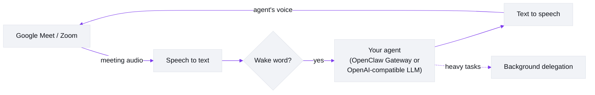

# Meetmate
<!-- repo-state:begin (generated; do not edit) -->
<p align="center"><sub>generation: <code>98da7e9</code> (2026-09-05T10:37:29Z) · verify: <a href="https://api.github.com/repos/caty-ai/meetmate/commits/main">API HEAD</a> · <a href="./status.json">status.json</a></sub></p>
<!-- repo-state:end -->

**English** | [日本語](https://github.com/caty-ai/meetmate/blob/main/docs/i18n/README.ja.md) | [中文](https://github.com/caty-ai/meetmate/blob/main/docs/i18n/README.zh.md) | [ไทย](https://github.com/caty-ai/meetmate/blob/main/docs/i18n/README.th.md)

[](https://github.com/caty-ai/meetmate/actions/workflows/test.yml)
[](https://github.com/caty-ai/meetmate/blob/main/LICENSE)
[](https://www.npmjs.com/package/meetmate)
[](https://nodejs.org/)
[](#what-it-does)
[](#quick-start)

<picture>
  <source media="(prefers-color-scheme: dark)" srcset="https://raw.githubusercontent.com/caty-ai/meetmate/main/docs/images/hero-dark.svg">
  
</picture>

**Bring your own AI agent into Google Meet, Zoom & Discord voice channels — as a real voice participant.**

Meetmate does exactly one thing: it gives *your* AI agent a seat in your meeting. It joins as a participant with a face and a voice — you call its name, it answers; you ask for something, it gets it done. We kept the scope that small on purpose, and polished that one thing relentlessly.

## Quick start

**What you need:** [Node.js](https://nodejs.org/) ≥ 26 · an [Attendee](https://attendee.dev/) account (Meet/Zoom) *or* a [Discord bot token](https://github.com/caty-ai/meetmate/blob/main/docs/setup-guide.md#discord-ボット音声チャンネル参加) (Discord — no Attendee, no tunnel) · [Soniox](https://soniox.com/) (or [Deepgram](https://deepgram.com/)) for speech-to-text · a TTS provider ([Fish Audio](https://fish.audio/), ElevenLabs, or OpenAI-compatible) · an LLM endpoint ([OpenClaw Gateway](https://openclaw.ai/) or any OpenAI-compatible) · usually [ngrok](https://ngrok.com/) or [Tailscale](https://tailscale.com/) for Meet/Zoom · and Google Meet will ask you to admit the bot. The third-party services may cost money.

In an empty folder:

```bash
npm install meetmate
npx meetmate init     # the wizard collects your API keys, voice ID, and LLM endpoint — and tells you where to get each
npx meetmate start    # starts the server and prints the settings-UI URL
```

Open the printed URL — it's the settings UI, not the dashboard yet. If anything required is still empty (or you skipped `init` entirely — the server still starts, just in setup mode), a banner tells you what's missing; fill it in, save, and restart. One exception can't be filled in from the browser: the LLM connection values (gateway URL/token or the OpenAI-compatible key) are environment-only — the `init` wizard writes them to `.env` for you, so if you skipped it, add them there. Once it's loaded, open the dashboard at the same host's `/`, paste a Meet or Zoom URL, and click **Join** — [here's what that screen looks like](#what-it-looks-like). Approve the bot's "Ask to join" request in Meet — then call its wake word and start talking. (For Discord there's no URL: pick the Discord transport on the same dashboard and enter the server and voice-channel IDs — the [setup guide's Discord section](https://github.com/caty-ai/meetmate/blob/main/docs/setup-guide.md#discord-ボット音声チャンネル参加) covers creating the bot first.) ngrok/Tailscale and the Meet admission step stay manual; the wizard's closing message and the [Setup guide](https://github.com/caty-ai/meetmate/blob/main/docs/setup-guide.md) walk you through them.

## What it does

- **It's a participant, not a notetaker.** Your agent shows up in the participant grid with its own avatar, listens to the room, and speaks — with wake-word detection and barge-in (talk over it and it stops; Meet/Zoom — barge-in is not part of the Discord path).
- **It's *your* agent.** Connect the agent you already use — with its memory, personality, and skills — via OpenClaw Gateway. The same "them" your team already knows walks into the room, so no two Meetmates sound alike. (No gateway? Any OpenAI-compatible endpoint works too, as a simpler baseline: plain LLM, built-in persona — see [LLM providers](https://github.com/caty-ai/meetmate/blob/main/docs/TECHNICAL.md#llm-providers).)
- **Ask it things, right there.** "Summarize where we landed and post it to the channel." Heavy work is delegated to a background session automatically, so the agent stays in the conversation while the task runs.
- **Ordinary is the point.** No push-to-talk, no special commands, no awkward silences. You talk to it the way you talk to a colleague — that this feels unremarkable is the product.
- **Works where you meet, runs where you work.** Google Meet, Zoom, and Discord voice channels on the meeting side; Windows, macOS, and Linux on the server side. A config file, your API keys, one command — add a custom avatar if you like.

## What it looks like

One screen, one job: get your agent into the room. This is the dashboard, at `/` — once setup is done, it's one click away from the settings UI (the screen `npx meetmate start` actually prints the URL for). (Its labels are Japanese today; the captions below tell you what each step does.)


1. **Start.** Once setup is done, this is what greets you at `/`. The big field takes a meeting; **Join** stays disabled until it has one.
2. **Paste an invite.** A bare Meet/Zoom URL works — but so does a whole calendar invite, pasted as-is. Meetmate extracts the meeting URL for you (the green "検出済み" line) and enables **Join**.

   

3. **Join and wait at the door.** A session card appears the moment you click — the elapsed timer starts right away, next to the WS status and your agent's name. The bot spins up (🔄 起動中...), asks Meet for admission, and the WS status flips to connected once it's in the room.

   

4. **Admit it in Meet.** The one manual step, on your side of the call — approve the bot's "Ask to join" request like any other guest. Then call its wake word and start talking.

The [Setup guide](https://github.com/caty-ai/meetmate/blob/main/docs/setup-guide.md) walks through the same flow with more detail, from API keys to first hello.

**Configure from the browser.** Every day-to-day setting lives behind that same settings UI — vendor keys, the wake word, the greeting, voice presets, connection tests — organized into tabs, with per-field notes on whether a change applies live or needs a restart. There's no repo to clone or JSON to hand-edit; only connection values like the gateway URL/token (and a couple of generated tokens) stay in `.env` as environment values.


See the [settings reference](https://github.com/caty-ai/meetmate/blob/main/docs/setup-guide.md#設定リファレンスsettings-ui) for the full tab-by-tab breakdown.

## What a meeting feels like

From the moment you call its name to the moment it leaves:

- You say its wake word — it comes alive and listens.
- It greets the room once when it joins, then stays quiet until you address it.
- Mid-meeting, talk to it like a colleague: ask it a question, have it look something up, ask it to drop a note in Slack, or hand it a task to track.
- Say goodbye and it signs off with a short farewell before leaving the call.
- After the call, if you've connected Slack, a summary and any captured action items are already waiting there.

A quick exchange, mid-meeting:

```
You:      "Meetmate, can you check what changed in the pricing doc since Monday?"
Meetmate: [soft voice] Got it, checking now.
          ...a few seconds later...
Meetmate: [warm] Two changes — the annual discount moved to 15%, and a new
          enterprise tier was added. Want me to post the diff to the channel?
```

## Current status

| Area | Current | Notes |
|---|---|---|
| OpenClaw Gateway | Supported | Primary path today: memory, skills, tools, and delegation all stay on your existing agent. |
| OpenAI-compatible baseline | Supported | Plain voice-agent mode for any compatible endpoint. |
| Claude Code via OpenAI-compatible gateway | Supported | Live Google Meet end-to-end verified on August 30, 2026 with Claude Code as the brain ([smoke record](https://github.com/caty-ai/meetmate/blob/main/docs/claude-code-smoke-test-2026-08-30.md)) — join, addressed voice turns, context, exit command, and post-meeting summary all ran through the generic `openai-compatible` provider against a stateful Claude Code gateway. No Claude-specific provider branch. Note: the bot does not stop speaking when interrupted (inbound audio is gated while it talks). Wiring notes: [setup guide — stateful gateways](https://github.com/caty-ai/meetmate/blob/main/docs/setup-guide.md#3-envgateway-接続情報環境専用値). |
| Hermes api_server | Supported | Live Google Meet end-to-end verified on August 29, 2026 ([#76](https://github.com/caty-ai/meetmate/issues/76)) — real meetings ran voice conversations through the generic `openai-compatible` provider (SSH tunnel, Bearer auth). Covers the voice-agent path. Wiring notes: [LLM providers](https://github.com/caty-ai/meetmate/blob/main/docs/TECHNICAL.md#llm-providers). |
| Codex / Kimi Code | Planned | Not wired yet. |
| Avatar in the meeting grid | Static image by default; two live-avatar experiments | Frame-swap lip-sync shipped in v8.4.0 and a 2.5D-rig proof of concept has landed. The static image remains the default; live-avatar work continues in [#2](https://github.com/caty-ai/meetmate/issues/2). |

Want the avatar to move? Two experiments already ship: a frame-swap lip-sync avatar that animates six PNGs in time with speech (v8.4.0), and a 2.5D-rig proof of concept. The static image stays the default — the [frame-swap avatar section of the setup guide](https://github.com/caty-ai/meetmate/blob/main/docs/setup-guide.md#実験的なフレーム差し替えアバター) shows how to try the frame-swap one (it needs Fish Audio TTS and a public HTTPS origin); the rig PoC has no user docs yet.

## Platform notes

| Topic | Current reality |
|---|---|
| Google Meet | Mainline path. Start here first. |
| Zoom | Works for meetings you host/control yourself today. Do not assume support for external-hosted Zoom meetings, OBF, or managed OAuth setups yet. |
| Discord voice channels | **Preview** — shipped ahead of the live end-to-end verification ([#138](https://github.com/caty-ai/meetmate/issues/138)); still unverified on a real server: the voice exit command leaving the channel ([#139](https://github.com/caty-ai/meetmate/issues/139)) and a visible surface for multi-speaker attribution ([#140](https://github.com/caty-ai/meetmate/issues/140)). **Servers you manage yourself only** in this first release. Official Bot API (discord.js) — no Attendee, no tunnel; the bot connects outbound. Guild allowlist is fail-closed (empty = every join refused), intents/permissions are minimal by design, and the bot always announces itself on join before any audio is captured. Leave via the dashboard button; the voice exit command on Discord is under verification ([#139](https://github.com/caty-ai/meetmate/issues/139)). Barge-in is not part of the Discord path in this release. The Discord path currently requires Fish Audio TTS. Setup: [Discord bot section of the setup guide](https://github.com/caty-ai/meetmate/blob/main/docs/setup-guide.md#discord-ボット音声チャンネル参加). |
| Server OS & autostart | Windows (via WSL2), macOS, and Linux all run the server. One installer registers the always-on service: `scripts/install-service.sh` sets up launchd on macOS or a systemd user unit on Linux/WSL2 (WSL2 needs `systemd=true` in `/etc/wsl.conf`; run ngrok inside WSL2, or set `server.ngrokDomain` explicitly). Details: [setup guide — always-on service](https://github.com/caty-ai/meetmate/blob/main/docs/setup-guide.md#常駐サービス自動起動). |
| MCP vs voice brain | Meetmate's MCP server is a control plane for `join` / `leave` / `status`. The voice brain is separate: your real agent runs behind OpenClaw or another OpenAI-compatible gateway and speaks in the meeting. |

## What you need

The `init` wizard collects the API keys, the voice ID, and the LLM endpoint for you; ngrok/Tailscale and the Meet admission step remain manual. This table is the reference for what each item is and when it applies.

| Item | Purpose | Setting names | When needed | Notes |
|---|---|---|---|---|
| [Node.js](https://nodejs.org/) 26+ | Run the server | `node`, `npm` | Always | Required. |
| [Attendee](https://attendee.dev/) account + API key | Meeting bot join/leave + audio I/O | `ATTENDEE_API_KEY` | Meet / Zoom | Hosted service; check current free/paid availability. Not used by the Discord path. |
| Discord bot token | Voice-channel bot identity | `discord_bot_token` (settings UI, masked) / `DISCORD_BOT_TOKEN` | Discord | Create the bot in the [Developer Portal](https://discord.com/developers/applications) with minimal intents/permissions; the bot's avatar is also set there. [Setup guide](https://github.com/caty-ai/meetmate/blob/main/docs/setup-guide.md#discord-ボット音声チャンネル参加). |
| Hub token | Authenticate this installation with hosted cloud arbitration | `HUB_TOKEN` (environment alias for existing installs) | Hosted hub | Provision new connections through **Settings → Connections → Cloud arbitration**; do not copy the token into logs or shared files. |
| [Soniox](https://console.soniox.com/) account + API key | Default speech-to-text | `STT_PROVIDER=soniox`, `SONIOX_API_KEY` | Usually | Default path. Pricing/trial terms vary. |
| [Deepgram](https://console.deepgram.com/signup) account + API key | Optional alternate speech-to-text | `STT_PROVIDER=deepgram`, `DEEPGRAM_API_KEY` | Optional | Only if you switch away from Soniox. |
| [Fish Audio](https://fish.audio/) account + voice | Default text-to-speech voice | `TTS_PROVIDER=fish-audio`, `FISH_AUDIO_API_KEY`, `FISH_AUDIO_VOICE_ID` | Default | Existing configurations continue to use this provider. |
| [ElevenLabs](https://elevenlabs.io/) account + voice | Alternate text-to-speech voice | `TTS_PROVIDER=elevenlabs`, `ELEVENLABS_API_KEY`, `ELEVENLABS_VOICE_ID` | Optional | Configure the model in the settings UI; PCM output follows the TTS sample rate. |
| OpenAI-compatible TTS | OpenAI-hosted or local text-to-speech | `TTS_PROVIDER=openai-compatible`, `OPENAI_COMPATIBLE_TTS_BASE_URL`, `OPENAI_COMPATIBLE_TTS_MODEL`, `OPENAI_COMPATIBLE_TTS_VOICE` | Optional | The key is required for `api.openai.com` but optional for a non-default local server such as Irodori-TTS. PCM output requires 24 kHz. |
| [OpenClaw Gateway](https://openclaw.ai/) or another OpenAI-compatible LLM gateway | The actual voice brain | `LLM_PROVIDER`, `OPENCLAW_GATEWAY_URL`, `OPENCLAW_GATEWAY_TOKEN`, or `OPENAI_COMPATIBLE_BASE_URL`, `OPENAI_COMPATIBLE_API_KEY` | Always | OpenClaw is the mainline path; stateful OpenAI-compatible gateways are documented in the setup guide. |
| [ngrok](https://ngrok.com/) or [Tailscale](https://tailscale.com/) | Public/reachable bot WebSocket path | `server.ngrokDomain` for ngrok | Conditional | `ngrok` is the common path. Tailscale is an alternative when your network and Attendee deployment allow it. Pricing/free-plan details vary. |
| Google Meet permission to admit the bot | Let the bot enter the meeting | Meet UI “Ask to join” approval | Google Meet | You must approve the join request in Meet. |
| [Zoom Marketplace](https://marketplace.zoom.us/) app/admin setup | Zoom bot permission model | Attendee/Zoom-side app settings | Zoom only | Conditional. External-hosted meetings and managed OAuth are not claimed as supported. |

Enter keys through the `init` wizard or the settings UI — vendor keys (Soniox / Deepgram / Fish Audio / ElevenLabs / OpenAI-compatible TTS / Attendee / Slack) are stored in `config.json` (created with permissions 0600), while LLM connection values (gateway URL/token and the OpenAI-compatible LLM key) live in `.env`. Do not commit either file, screenshots of secrets, or shared config files with live credentials.

If you connect a tool-capable OpenAI-compatible gateway, keep that route local and trusted. Meetmate's trust opt-in is intended only for a trusted meeting with a trusted local gateway; external or untrusted meetings remain unsupported for that mode.

<a id="from-source"></a>

## From source (for contributors)

```bash
git clone git@github.com:caty-ai/meetmate.git
cd meetmate
npm install
cp .env.example .env && cp config.json.example config.json   # then fill in the keys
npm start
```

## Why we built this

Meetings are where humans actually collaborate — decisions, nuance, tone, the "oh wait, one more thing" moments. If your AI agent lives only in a chat box, it misses all of that.

We believe agents should sit where their humans sit. Not as a transcription bot at the edge of the call, but as a colleague in the grid: present, addressable, useful. And because it's *your* agent — with its own memory and character — the difference is between "an AI joined the call" and "*she* joined the call."

Meetmate is deliberately a small tool. It doesn't try to run your meeting, score your calls, or replace your calendar. It puts your agent in the room. Everything else is up to the two of you.

## How it works



One agent = one server instance.

**Multiple agents?** Run one Meetmate instance per agent (see the [setup guide’s second-instance section](https://github.com/caty-ai/meetmate/blob/main/docs/setup-guide.md#2人目のエージェントを増やすエクスポートインポート)).
Let [meet-floor-hub](https://github.com/caty-ai/meet-floor-hub) arbitrate who speaks.
In-meeting agent switching inside one instance is not supported.

The server bridges meeting audio into a speech pipeline (speech-to-text → your agent's LLM → text-to-speech) and streams the reply back into the call — fast enough to feel like conversation.

Full engineering detail — architecture, module map, providers, audio specs — lives in [docs/TECHNICAL.md](https://github.com/caty-ai/meetmate/blob/main/docs/TECHNICAL.md).

## Configuration

Entry points for the most common tweaks. The full reference is [docs/operations.md](https://github.com/caty-ai/meetmate/blob/main/docs/operations.md).

| I want to… | Look at |
|---|---|
| Connect my own agent (OpenClaw Gateway) | [Setup guide](https://github.com/caty-ai/meetmate/blob/main/docs/setup-guide.md) |
| Connect cloud arbitration | Settings UI › Connections › Cloud arbitration |
| Use a generic OpenAI-compatible endpoint | [TECHNICAL.md — LLM providers](https://github.com/caty-ai/meetmate/blob/main/docs/TECHNICAL.md#llm-providers) |
| Make responses come back faster | [Soniox tuning](https://github.com/caty-ai/meetmate/blob/main/docs/operations.md#stt-プロバイダ切替soniox-チューニング) |
| Change the voice, speed, or TTS behavior | [Voice profile](https://github.com/caty-ai/meetmate/blob/main/docs/operations.md#音声プロファイルtts) |
| Use background delegation for heavy work | [Delegation harness](https://github.com/caty-ai/meetmate/blob/main/docs/operations.md#委譲強制ハーネス79) |
| Roll back to previous settings when something is off | [Emergency rollback envs](https://github.com/caty-ai/meetmate/blob/main/docs/operations.md#緊急-rollback-用-env) |
| Control meetings from Claude Code or another client (MCP control plane) | [TECHNICAL.md — MCP server](https://github.com/caty-ai/meetmate/blob/main/docs/TECHNICAL.md#mcp-server-control-plane) |
| Make your real agent be the voice brain | [Setup guide](https://github.com/caty-ai/meetmate/blob/main/docs/setup-guide.md) |

Disconnecting cloud arbitration removes saved installation credentials, but cannot remove a `HUB_TOKEN` supplied by the operating-system environment.

Something not working? See [Troubleshooting](https://github.com/caty-ai/meetmate/blob/main/docs/TECHNICAL.md#troubleshooting).

## Documentation

| Document | Contents |
|---|---|
| [docs/setup-guide.md](https://github.com/caty-ai/meetmate/blob/main/docs/setup-guide.md) | Zero-to-first-meeting, step by step |
| [docs/TECHNICAL.md](https://github.com/caty-ai/meetmate/blob/main/docs/TECHNICAL.md) | Features in detail, architecture, providers, MCP, development |
| [docs/architecture.md](https://github.com/caty-ai/meetmate/blob/main/docs/architecture.md) | Architecture deep dive |
| [docs/operations.md](https://github.com/caty-ai/meetmate/blob/main/docs/operations.md) | Full operations and tuning reference |
| [docs/deploy-checklist.md](https://github.com/caty-ai/meetmate/blob/main/docs/deploy-checklist.md) | Deployment checklist |
| [Caty Cloud hub v1 contract](https://github.com/shojikumaru/caty-cloud/tree/epic/hosted-v1/docs/contracts/hub-v1) | Hosted hub setup, admission, token, and configuration contracts |

> ℹ️ Some documents under `docs/` are currently in Japanese; the reference tables and command snippets are language-neutral.

## Project status

- **Releases**: See [GitHub Releases](https://github.com/caty-ai/meetmate/releases) for published versions.
- **In progress**: npm distribution and public release track ([#3](https://github.com/caty-ai/meetmate/issues/3) / [#4](https://github.com/caty-ai/meetmate/issues/4))

## Contributing

Issues and PRs welcome — see [CONTRIBUTING.md](https://github.com/caty-ai/meetmate/blob/main/CONTRIBUTING.md). We use an issue-first flow and Conventional Commits.

## Acknowledgments

Meetmate stands on excellent services and OSS: [Attendee](https://attendee.dev/) (meeting bot infrastructure), [Soniox](https://soniox.com/) (real-time STT), [Fish Audio](https://fish.audio/) (expressive TTS), [OpenClaw Gateway](https://openclaw.ai/) (agent infrastructure — SOUL / memory / skills / tools), and the OpenAI-compatible LLM ecosystem.

## License

[MIT](https://github.com/caty-ai/meetmate/blob/main/LICENSE) — see [NOTICE](https://github.com/caty-ai/meetmate/blob/main/NOTICE) for attribution.
