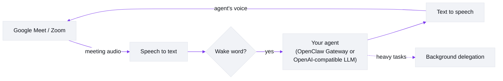

# Meetmate

**English** | [日本語](https://github.com/caty-ai/meetmate/blob/main/docs/i18n/README.ja.md) | [中文](https://github.com/caty-ai/meetmate/blob/main/docs/i18n/README.zh.md) | [ไทย](https://github.com/caty-ai/meetmate/blob/main/docs/i18n/README.th.md)

[](https://github.com/caty-ai/meetmate/actions/workflows/test.yml)
[](https://github.com/caty-ai/meetmate/blob/main/LICENSE)
[](https://www.npmjs.com/package/meetmate)
[](https://nodejs.org/)
[](#what-it-does)
[](#quick-start)

<picture>
  <source media="(prefers-color-scheme: dark)" srcset="https://raw.githubusercontent.com/caty-ai/meetmate/main/docs/images/hero-dark.svg">
  
</picture>

**Bring your own AI agent into Google Meet & Zoom — as a real voice participant.**

Meetmate does exactly one thing: it gives *your* AI agent a seat in your meeting. It joins as a participant with a face and a voice — you call its name, it answers; you ask for something, it gets it done. We kept the scope that small on purpose, and polished that one thing relentlessly.

## Quick start

**What you need:** Node.js ≥ 26 · an [Attendee](https://attendee.dev/) account · [Soniox](https://soniox.com/) (or [Deepgram](https://deepgram.com/)) for speech-to-text · [Fish Audio](https://fish.audio/) for the voice (including a voice ID) · an LLM endpoint (OpenClaw Gateway or any OpenAI-compatible) · usually [ngrok](https://ngrok.com/) or [Tailscale](https://tailscale.com/) · and Google Meet will ask you to admit the bot. The third-party services may cost money.

In an empty folder:

```bash
npm install meetmate
npx meetmate init     # the wizard collects your API keys, voice ID, and LLM endpoint — and tells you where to get each
npx meetmate start    # starts the server and prints the settings-UI URL
```

Open the printed URL, paste a Meet or Zoom URL, and click **Join**. Approve the bot's "Ask to join" request in Meet — then call its wake word and start talking. ngrok/Tailscale and the Meet admission step stay manual; the wizard's closing message and the [Setup guide](https://github.com/caty-ai/meetmate/blob/main/docs/setup-guide.md) walk you through them.

## What it does

- **It's a participant, not a notetaker.** Your agent shows up in the participant grid with its own avatar, listens to the room, and speaks — with wake-word detection and barge-in (talk over it and it stops).
- **It's *your* agent.** Connect the agent you already use — with its memory, personality, and skills — via OpenClaw Gateway. The same "them" your team already knows walks into the room, so no two Meetmates sound alike. (No gateway? Any OpenAI-compatible endpoint works too, as a simpler baseline: plain LLM, built-in persona — see [LLM providers](https://github.com/caty-ai/meetmate/blob/main/docs/TECHNICAL.md#llm-providers).)
- **Ask it things, right there.** "Summarize where we landed and post it to the channel." Heavy work is delegated to a background session automatically, so the agent stays in the conversation while the task runs.
- **Ordinary is the point.** No push-to-talk, no special commands, no awkward silences. You talk to it the way you talk to a colleague — that this feels unremarkable is the product.
- **Works where you meet, runs where you work.** Google Meet and Zoom on the meeting side; Windows, macOS, and Linux on the server side. A config file, your API keys, one command — add a custom avatar if you like.

> 📸 Screenshots and a demo GIF of a live meeting are on the way.

## Current status

| Area | Current | Notes |
|---|---|---|
| OpenClaw Gateway | Supported | Primary path today: memory, skills, tools, and delegation all stay on your existing agent. |
| OpenAI-compatible baseline | Supported | Plain voice-agent mode for any compatible endpoint. |
| Claude Code via OpenAI-compatible gateway | Integration in progress | Uses the generic `openai-compatible` provider. No Claude-specific provider branch. We will only call this supported after a real Google Meet end-to-end pass lands. |
| Hermes api_server | Endpoint verified, Meetmate wiring still pending | As of July 12, 2026, issue [#1](https://github.com/caty-ai/meetmate/issues/1) confirmed `POST /v1/chat/completions`, SSE, Bearer auth, and profile/persona injection. The remaining work is token handoff plus Meetmate smoke/E2E. |
| Codex / Kimi Code | Planned | Not wired yet. |
| Avatar in the meeting grid | Static image today | Live avatar is planned in [#2](https://github.com/caty-ai/meetmate/issues/2). |

## Platform notes

| Topic | Current reality |
|---|---|
| Google Meet | Mainline path. Start here first. |
| Zoom | Works for meetings you host/control yourself today. Do not assume support for external-hosted Zoom meetings, OBF, or managed OAuth setups yet. |
| MCP vs voice brain | Meetmate's MCP server is a control plane for `join` / `leave` / `status`. The voice brain is separate: your real agent runs behind OpenClaw or another OpenAI-compatible gateway and speaks in the meeting. |

## What you need

The `init` wizard collects the API keys, the voice ID, and the LLM endpoint for you; ngrok/Tailscale and the Meet admission step remain manual. This table is the reference for what each item is and when it applies.

| Item | Purpose | Setting names | When needed | Notes |
|---|---|---|---|---|
| Node.js 26+ | Run the server | `node`, `npm` | Always | Required. |
| [Attendee](https://attendee.dev/) account + API key | Meeting bot join/leave + audio I/O | `ATTENDEE_API_KEY` | Always | Hosted service; check current free/paid availability. |
| [Soniox](https://console.soniox.com/) account + API key | Default speech-to-text | `STT_PROVIDER=soniox`, `SONIOX_API_KEY` | Usually | Default path. Pricing/trial terms vary. |
| [Deepgram](https://console.deepgram.com/signup) account + API key | Optional alternate speech-to-text | `STT_PROVIDER=deepgram`, `DEEPGRAM_API_KEY` | Optional | Only if you switch away from Soniox. |
| [Fish Audio](https://fish.audio/) account + voice | Text-to-speech voice | `FISH_AUDIO_API_KEY`, `FISH_AUDIO_VOICE_ID`, `TTS_PROVIDER=fish-audio` | Always | Voice ID comes from the voice page URL. Pricing/trial terms vary. |
| OpenClaw Gateway or another OpenAI-compatible LLM gateway | The actual voice brain | `LLM_PROVIDER`, `OPENCLAW_GATEWAY_URL`, `OPENCLAW_GATEWAY_TOKEN`, or `OPENAI_COMPATIBLE_BASE_URL`, `OPENAI_COMPATIBLE_API_KEY` | Always | OpenClaw is the mainline path; stateful OpenAI-compatible gateways are documented in the setup guide. |
| [ngrok](https://ngrok.com/) or [Tailscale](https://tailscale.com/) | Public/reachable bot WebSocket path | `server.ngrokDomain` for ngrok | Conditional | `ngrok` is the common path. Tailscale is an alternative when your network and Attendee deployment allow it. Pricing/free-plan details vary. |
| Google Meet permission to admit the bot | Let the bot enter the meeting | Meet UI “Ask to join” approval | Google Meet | You must approve the join request in Meet. |
| [Zoom Marketplace](https://marketplace.zoom.us/) app/admin setup | Zoom bot permission model | Attendee/Zoom-side app settings | Zoom only | Conditional. External-hosted meetings and managed OAuth are not claimed as supported. |

Keep all keys and tokens in `.env` (plus `config.json` for the openai-compatible apiKey — the wizard puts each in the right place). Do not commit either file, screenshots of secrets, or shared config files with live credentials.

If you connect a tool-capable OpenAI-compatible gateway, keep that route local and trusted. Meetmate's trust opt-in is intended only for a trusted meeting with a trusted local gateway; external or untrusted meetings remain unsupported for that mode.

<a id="from-source"></a>

## From source (for contributors)

```bash
git clone git@github.com:caty-ai/meetmate.git
cd meetmate
npm install
cp .env.example .env && cp config.json.example config.json   # then fill in the keys
npm start
```

## Why we built this

Meetings are where humans actually collaborate — decisions, nuance, tone, the "oh wait, one more thing" moments. If your AI agent lives only in a chat box, it misses all of that.

We believe agents should sit where their humans sit. Not as a transcription bot at the edge of the call, but as a colleague in the grid: present, addressable, useful. And because it's *your* agent — with its own memory and character — the difference is between "an AI joined the call" and "*she* joined the call."

Meetmate is deliberately a small tool. It doesn't try to run your meeting, score your calls, or replace your calendar. It puts your agent in the room. Everything else is up to the two of you.

## How it works



One agent = one server instance. The server bridges meeting audio into a speech pipeline (speech-to-text → your agent's LLM → text-to-speech) and streams the reply back into the call — fast enough to feel like conversation.

Full engineering detail — architecture, module map, providers, audio specs — lives in [docs/TECHNICAL.md](https://github.com/caty-ai/meetmate/blob/main/docs/TECHNICAL.md).

## Configuration

Entry points for the most common tweaks. The full reference is [docs/operations.md](https://github.com/caty-ai/meetmate/blob/main/docs/operations.md).

| I want to… | Look at |
|---|---|
| Connect my own agent (OpenClaw Gateway) | [Setup guide](https://github.com/caty-ai/meetmate/blob/main/docs/setup-guide.md) |
| Use a generic OpenAI-compatible endpoint | [TECHNICAL.md — LLM providers](https://github.com/caty-ai/meetmate/blob/main/docs/TECHNICAL.md#llm-providers) |
| Make responses come back faster | [Soniox tuning](https://github.com/caty-ai/meetmate/blob/main/docs/operations.md#stt-プロバイダ切替soniox-チューニング) |
| Change the voice, speed, or TTS behavior | [Voice profile](https://github.com/caty-ai/meetmate/blob/main/docs/operations.md#音声プロファイルtts) |
| Use background delegation for heavy work | [Delegation harness](https://github.com/caty-ai/meetmate/blob/main/docs/operations.md#委譲強制ハーネス79) |
| Roll back to previous settings when something is off | [Emergency rollback envs](https://github.com/caty-ai/meetmate/blob/main/docs/operations.md#緊急-rollback-用-env) |
| Control meetings from Claude Code or another client (MCP control plane) | [TECHNICAL.md — MCP server](https://github.com/caty-ai/meetmate/blob/main/docs/TECHNICAL.md#mcp-server-control-plane) |
| Make your real agent be the voice brain | [Setup guide](https://github.com/caty-ai/meetmate/blob/main/docs/setup-guide.md) |

Something not working? See [Troubleshooting](https://github.com/caty-ai/meetmate/blob/main/docs/TECHNICAL.md#troubleshooting).

## Documentation

| Document | Contents |
|---|---|
| [docs/setup-guide.md](https://github.com/caty-ai/meetmate/blob/main/docs/setup-guide.md) | Zero-to-first-meeting, step by step |
| [docs/TECHNICAL.md](https://github.com/caty-ai/meetmate/blob/main/docs/TECHNICAL.md) | Features in detail, architecture, providers, MCP, development |
| [docs/architecture.md](https://github.com/caty-ai/meetmate/blob/main/docs/architecture.md) | Architecture deep dive |
| [docs/operations.md](https://github.com/caty-ai/meetmate/blob/main/docs/operations.md) | Full operations and tuning reference |
| [docs/deploy-checklist.md](https://github.com/caty-ai/meetmate/blob/main/docs/deploy-checklist.md) | Deployment checklist |

> ℹ️ Some documents under `docs/` are currently in Japanese; the reference tables and command snippets are language-neutral.

## Project status

- **Releases**: See [GitHub Releases](https://github.com/caty-ai/meetmate/releases) for published versions.
- **In progress**: npm distribution and public release track ([#3](https://github.com/caty-ai/meetmate/issues/3) / [#4](https://github.com/caty-ai/meetmate/issues/4))

## Contributing

Issues and PRs welcome — see [CONTRIBUTING.md](https://github.com/caty-ai/meetmate/blob/main/CONTRIBUTING.md). We use an issue-first flow and Conventional Commits.

## Acknowledgments

Meetmate stands on excellent services and OSS: [Attendee](https://attendee.dev/) (meeting bot infrastructure), [Soniox](https://soniox.com/) (real-time STT), [Fish Audio](https://fish.audio/) (expressive TTS), OpenClaw Gateway (agent infrastructure — SOUL / memory / skills / tools), and the OpenAI-compatible LLM ecosystem.

## License

[MIT](https://github.com/caty-ai/meetmate/blob/main/LICENSE) — see [NOTICE](https://github.com/caty-ai/meetmate/blob/main/NOTICE) for attribution.
