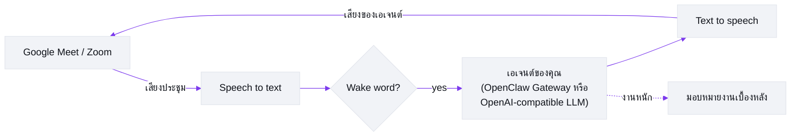

# Meetmate

[English](README.md) | [日本語](README.ja.md) | [中文](README.zh.md) | **ไทย**

> เอกสารนี้เป็นคำแปลของ [README.md](README.md) (ภาษาอังกฤษ ซึ่งเป็นฉบับหลัก) หากเนื้อหาต่างกัน ให้ยึดตามเวอร์ชันภาษาอังกฤษ

[](LICENSE)
[](https://nodejs.org/)
[](#ทำอะไรได้บ้าง)
[](#ลองใน-30-วินาที)

<picture>
  <source media="(prefers-color-scheme: dark)" srcset="docs/images/hero-dark.svg">
  
</picture>

**พา AI เอเจนต์ของคุณเข้าสู่ Google Meet และ Zoom — ในฐานะผู้เข้าร่วมตัวจริงที่พูดได้**

Meetmate ทำแค่สิ่งเดียว: จองที่นั่งในการประชุมให้ AI เอเจนต์*ของคุณ* มันเข้าร่วมในฐานะผู้เข้าร่วมที่มีทั้งหน้าและเสียง — เรียกชื่อมัน มันตอบ; ฝากอะไรไว้ มันจัดการให้ เราตั้งใจจำกัดขอบเขตไว้แค่นั้น แล้วขัดเกลาสิ่งเดียวนั้นให้เนียนที่สุด

## ทำอะไรได้บ้าง

- **มันคือผู้เข้าร่วม ไม่ใช่บอทจดรายงานการประชุม** เอเจนต์ของคุณโผล่ในกริดผู้เข้าร่วมพร้อมอวาตาร์ของตัวเอง ฟังบทสนทนาในห้อง และพูด — พร้อมการตรวจจับ wake word และ barge-in (พูดแทรกได้เลย มันจะหยุดให้เอง)
- **มันคือเอเจนต์*ของคุณ*** เชื่อมเอเจนต์ที่คุณใช้อยู่แล้ว — พร้อมความจำ บุคลิก และทักษะครบถ้วน — ผ่าน OpenClaw Gateway "คนเดิม" ที่ทีมคุ้นเคยเดินเข้าห้องประชุมมาเลย จึงไม่มี Meetmate สองตัวไหนพูดเหมือนกัน (ไม่มี Gateway? ใช้เอนด์พอยต์ OpenAI-compatible อะไรก็ได้ เป็นโหมดพื้นฐานที่เรียบง่ายกว่า: LLM ธรรมดา + เพอร์โซนาในตัว — ดู [LLM providers](docs/TECHNICAL.md#llm-providers))
- **สั่งงานได้ทันทีตรงนั้น** "สรุปให้หน่อยว่าเราลงตัวตรงไหน แล้วโพสต์เข้าช่องด้วย" งานหนักจะถูกมอบหมายให้เซสชันเบื้องหลังโดยอัตโนมัติ เอเจนต์จึงอยู่คุยต่อได้ในขณะที่งานกำลังทำ
- **"ธรรมดา" คือประเด็น** ไม่ต้องกดค้างเพื่อพูด ไม่มีคำสั่งพิเศษ ไม่มีความเงียบที่น่าอึดอัด คุณคุยกับมันเหมือนคุยกับเพื่อนร่วมงาน — ความรู้สึก "ไม่มีอะไรพิเศษ" นั่นแหละคือผลิตภัณฑ์
- **ประชุมที่ไหนก็ได้ รันที่ไหนก็ได้** ฝั่งการประชุมคือ Google Meet และ Zoom ฝั่งเซิร์ฟเวอร์คือ Windows, macOS และ Linux แค่ไฟล์คอนฟิก คีย์ API และคำสั่งเดียว — จะเปลี่ยนรูปอวาตาร์ก็ได้ตามใจ

> 📸 ภาพหน้าจอและ GIF สาธิตจากการประชุมจริงกำลังจะตามมา

## ลองใน 30 วินาที

> ℹ️ กว่าจะมี npm release แรก ให้ใช้[การติดตั้งจากซอร์ส](#รันจากซอร์ส)ด้านล่าง

```bash
mkdir my-agent && cd my-agent
npm install meetmate
npx meetmate init     # ถาม API key 3 ตัว สร้าง config.json + .env แล้วพิมพ์ขั้นตอนถัดไป
npx meetmate start    # เริ่มเซิร์ฟเวอร์และพิมพ์ URL ของหน้าตั้งค่า
```

เปิด http://localhost:5005 วาง URL ของ Meet หรือ Zoom แล้วกด **Join** — เอเจนต์ของคุณจะเข้าห้องประชุม เรียก wake word แล้วเริ่มพูดได้เลย

ข้อกำหนดเบื้องต้น (Node.js ≥ 26, API key ของ [Attendee](https://attendee.dev/) สำหรับบอทประชุม, [Soniox](https://soniox.com/) สำหรับ speech-to-text และ [Fish Audio](https://fish.audio/) สำหรับเสียงพูด) มีคำแนะนำทีละขั้นตอนใน[คู่มือติดตั้ง](docs/setup-guide.md)

### รันจากซอร์ส

```bash
git clone git@github.com:caty-ai/meetmate.git
cd meetmate
npm install
cp .env.example .env && cp config.json.example config.json   # แล้วกรอก key ลงไป
npm start
```

## ทำไมเราถึงสร้างมันขึ้นมา

การประชุมคือที่ที่มนุษย์ร่วมมือกันจริงๆ — การตัดสินใจ นัยยะ น้ำเสียง และช่วงเวลาแบบ "เดี๋ยวนะ มีอีกเรื่อง" ถ้า AI เอเจนต์ของคุณอยู่แต่ในกล่องแชท มันพลาดทั้งหมดนั้นไป

เราเชื่อว่าเอเจนต์ควรนั่งตรงที่มนุษย์ของมันนั่ง ไม่ใช่เป็นบอทถอดเสียงที่ขอบสาย แต่เป็นเพื่อนร่วมงานในกริด: อยู่ตรงนั้น เรียกได้ ใช้งานได้จริง และเพราะมันคือเอเจนต์*ของคุณ* — พร้อมความจำและตัวตนของมันเอง — ความต่างมันอยู่ระหว่าง "มี AI เข้าสายมา" กับ "*เธอ*เข้าสายมา"

Meetmate เป็นเครื่องมือเล็กๆ โดยตั้งใจ มันไม่พยายามคุมการประชุมของคุณ ไม่ให้คะแนนสายของคุณ และไม่มาแทนปฏิทินของคุณ มันแค่พาเอเจนต์ของคุณเข้าห้อง ที่เหลือเป็นเรื่องของคุณสองคน

## มันทำงานอย่างไร



1 เอเจนต์ = 1 เซิร์ฟเวอร์อินสแตนซ์ เซิร์ฟเวอร์เชื่อมเสียงประชุมเข้ากับไปป์ไลน์เสียง (speech-to-text → LLM ของเอเจนต์คุณ → text-to-speech) แล้วสตรีมคำตอบกลับเข้าสาย — เร็วพอที่จะรู้สึกเหมือนบทสนทนาจริง

รายละเอียดเชิงวิศวกรรมทั้งหมด — สถาปัตยกรรม แผนที่โมดูล ผู้ให้บริการ สเปกเสียง — อยู่ใน [docs/TECHNICAL.md](docs/TECHNICAL.md)

## การตั้งค่า

จุดเริ่มต้นสำหรับการปรับแต่งที่พบบ่อย อ้างอิงฉบับเต็มอยู่ที่ [docs/operations.md](docs/operations.md)

| ฉันอยาก… | ดูที่ |
|---|---|
| เชื่อมเอเจนต์ของตัวเอง (OpenClaw Gateway) | [คู่มือติดตั้ง](docs/setup-guide.md) |
| ใช้เอนด์พอยต์ OpenAI-compatible ทั่วไป | [TECHNICAL.md — LLM providers](docs/TECHNICAL.md#llm-providers) |
| ให้ตอบกลับเร็วขึ้น | [การปรับจูน Soniox](docs/operations.md#stt-プロバイダ切替soniox-チューニング) |
| เปลี่ยนเสียง ความเร็ว หรือพฤติกรรม TTS | [โปรไฟล์เสียง](docs/operations.md#音声プロファイルtts) |
| ใช้การมอบหมายงานเบื้องหลังสำหรับงานหนัก | [Delegation harness](docs/operations.md#委譲強制ハーネス79) |
| ย้อนกลับไปการตั้งค่าก่อนหน้าเมื่อมีปัญหา | [Env สำหรับ rollback ฉุกเฉิน](docs/operations.md#緊急-rollback-用-env) |
| ควบคุมการประชุมจาก Claude Code (MCP) | [TECHNICAL.md — MCP server](docs/TECHNICAL.md#mcp-server-control-plane) |

มีอะไรไม่ทำงาน? ดู[การแก้ไขปัญหา](docs/TECHNICAL.md#troubleshooting)

## เอกสาร

| เอกสาร | เนื้อหา |
|---|---|
| [docs/setup-guide.md](docs/setup-guide.md) | จากศูนย์ถึงการประชุมครั้งแรก ทีละขั้นตอน |
| [docs/TECHNICAL.md](docs/TECHNICAL.md) | ฟีเจอร์แบบละเอียด สถาปัตยกรรม ผู้ให้บริการ MCP การพัฒนา |
| [docs/architecture.md](docs/architecture.md) | เจาะลึกสถาปัตยกรรม |
| [docs/operations.md](docs/operations.md) | อ้างอิงการดำเนินงานและการปรับจูนฉบับเต็ม |
| [docs/deploy-checklist.md](docs/deploy-checklist.md) | เช็กลิสต์การ deploy |

> ℹ️ เอกสารบางส่วนใน `docs/` ยังเป็นภาษาญี่ปุ่น ตารางอ้างอิงและคำสั่งต่าง ๆ ใช้ได้โดยไม่ขึ้นกับภาษา

## สถานะโปรเจกต์

- **รีลีส**: ดูเวอร์ชันที่เผยแพร่แล้วได้ที่ [GitHub Releases](https://github.com/caty-ai/meetmate/releases)
- **กำลังดำเนินการ**: การแจกจ่ายผ่าน npm และเส้นทาง public release ([#136](https://github.com/caty-ai/meetmate/issues/136) / [#107](https://github.com/caty-ai/meetmate/issues/107))

## การมีส่วนร่วม

ยินดีรับ Issue และ PR — ดู [CONTRIBUTING.md](CONTRIBUTING.md) เราใช้ flow แบบ issue-first และ Conventional Commits

## กิตติกรรมประกาศ

Meetmate ยืนอยู่บนบริการและ OSS ที่ยอดเยี่ยม: [Attendee](https://attendee.dev/) (โครงสร้างพื้นฐานบอทประชุม), [Soniox](https://soniox.com/) (STT แบบเรียลไทม์), [Fish Audio](https://fish.audio/) (TTS ที่สื่ออารมณ์), OpenClaw Gateway (โครงสร้างพื้นฐานเอเจนต์ — SOUL / ความจำ / ทักษะ / เครื่องมือ) และระบบนิเวศของ OpenAI-compatible LLM

## สัญญาอนุญาต

[Apache-2.0](LICENSE) — ดูการระบุแหล่งที่มาได้ที่ [NOTICE](NOTICE)
