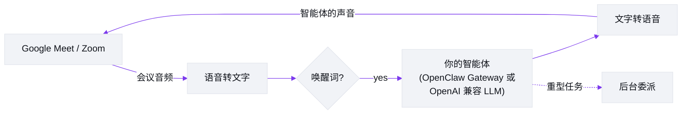

# Meetmate

[English](README.md) | [日本語](README.ja.md) | **中文** | [ไทย](README.th.md)

> 本文档是 [README.md](README.md)(英文版,为正本)的翻译。如内容出现不一致,以英文版为准。

[](https://github.com/caty-ai/meetmate/actions/workflows/test.yml)
[](LICENSE)
[](https://nodejs.org/)
[](#它能做什么)
[](#30-秒快速上手)

<picture>
  <source media="(prefers-color-scheme: dark)" srcset="docs/images/hero-dark.svg">
  
</picture>

**把你的 AI 智能体带进 Google Meet 和 Zoom —— 作为一名真正能开口说话的参会者。**

Meetmate 只做一件事:给*你的* AI 智能体在会议里留一个座位。它以有头像、有声音的参会者身份加入——你叫它的名字,它会回应;你交代事情,它会办妥。我们刻意把范围收得这么小,然后把这一件事打磨到极致。

## 它能做什么

- **它是参会者,不是会议纪要机器人。** 你的智能体带着自己的头像出现在参会者网格里,听会场讨论,开口说话——支持唤醒词检测和插话打断(你直接盖过它说话,它就会乖乖停下来)。
- **它是“你的”智能体。** 通过 OpenClaw Gateway,接入你已经在用的那个智能体——连同它的记忆、性格和技能。团队熟悉的那个“老搭档”,就这样走进会议室,所以没有两个 Meetmate 说话是一个味儿的。(没有 Gateway?任何 OpenAI 兼容端点也能用,作为更简单的基线:普通 LLM + 内置人设——见 [LLM providers](docs/TECHNICAL.md#llm-providers)。)
- **当场就能派活。** “把刚才讨论的结论总结一下,发到频道里。”重活会自动委派给后台会话,所以智能体一边继续参与对话,任务一边推进。
- **“平平无奇”正是卖点。** 不用按键发言,没有特殊命令,没有尴尬的沉默。你像跟同事说话一样跟它说话——这种“没什么特别”的感觉,本身就是产品。
- **在哪开会都行,在哪运行都行。** 会议侧支持 Google Meet 和 Zoom;服务器侧支持 Windows、macOS 和 Linux。一份配置、几个 API 密钥、一条命令——头像图片想换就换。

> 📸 真实会议中的截图和演示 GIF 正在路上。

## 30 秒快速上手

> ℹ️ 首个 npm 版本发布之前,请使用下方的[从源码运行](#从源码运行)。

```bash
mkdir my-agent && cd my-agent
npm install meetmate
npx meetmate init     # 询问 3 个 API 密钥,创建 config.json + .env,并打印后续步骤
npx meetmate start    # 启动服务器并打印设置界面 URL
```

打开 http://localhost:5005,粘贴 Meet 或 Zoom 链接,点击 **Join**——你的智能体就会进入会议。叫一声唤醒词,开始说话吧。

前置条件(Node.js ≥ 26,以及 [Attendee](https://attendee.dev/) 会议机器人、[Soniox](https://soniox.com/) 语音转文字、[Fish Audio](https://fish.audio/) 语音合成的 API 密钥)在[安装指南](docs/setup-guide.md)里有一步一步的说明。

### 从源码运行

```bash
git clone git@github.com:caty-ai/meetmate.git
cd meetmate
npm install
cp .env.example .env && cp config.json.example config.json   # 然后填入密钥
npm start
```

## 我们为什么做它

会议才是人类真正协作的地方——决定、细微的语气、“诶等等,还有一件事”的瞬间。如果你的 AI 智能体只活在聊天框里,这些它全都错过了。

我们相信,智能体应该坐在它主人坐的地方。不是作为通话边缘的转写机器人,而是网格里的一位同事:在场、可被点名、派得上用场。而且因为它是*你的*智能体——带着自己的记忆和性格——区别就在于“有个 AI 进了会议”和“***她***进来了”。

Meetmate 刻意做一个小工具。它不想主持你的会议,不想给你的通话打分,也不想取代你的日历。它把你的智能体带进会议室。剩下的,是你们俩的事。

## 工作原理



一个智能体 = 一个服务器实例。服务器把会议音频接入语音流水线(语音转文字 → 你的智能体的 LLM → 文字转语音),再把回复流式送回通话——快到感觉就像正常对话。

完整的工程细节——架构、模块地图、服务商、音频规格——都在 [docs/TECHNICAL.md](docs/TECHNICAL.md)。

## 配置

常见调整的入口。完整参考见 [docs/operations.md](docs/operations.md)。

| 我想…… | 看这里 |
|---|---|
| 接入我自己的智能体(OpenClaw Gateway) | [安装指南](docs/setup-guide.md) |
| 使用通用的 OpenAI 兼容端点 | [TECHNICAL.md — LLM providers](docs/TECHNICAL.md#llm-providers) |
| 让响应更快返回 | [Soniox 调优](docs/operations.md#stt-プロバイダ切替soniox-チューニング) |
| 更换声音、语速或 TTS 行为 | [声音配置](docs/operations.md#音声プロファイルtts) |
| 用后台委派处理重活 | [委派机制](docs/operations.md#委譲強制ハーネス79) |
| 出问题时回滚到之前的设置 | [紧急回滚 env](docs/operations.md#緊急-rollback-用-env) |
| 从 Claude Code 控制会议(MCP) | [TECHNICAL.md — MCP server](docs/TECHNICAL.md#mcp-server-control-plane) |

遇到问题了?查看[故障排查](docs/TECHNICAL.md#troubleshooting)。

## 文档

| 文档 | 内容 |
|---|---|
| [docs/setup-guide.md](docs/setup-guide.md) | 从零到第一场会议,步步引导 |
| [docs/TECHNICAL.md](docs/TECHNICAL.md) | 功能详解、架构、服务商、MCP、开发 |
| [docs/architecture.md](docs/architecture.md) | 架构深入解析 |
| [docs/operations.md](docs/operations.md) | 完整的运维与调优参考 |
| [docs/deploy-checklist.md](docs/deploy-checklist.md) | 部署清单 |

> ℹ️ `docs/` 下的部分文档目前为日语；其中的参考表格与命令片段不受语言影响，可直接使用。

## 项目状态

- **发布**:已发布版本见 [GitHub Releases](https://github.com/caty-ai/meetmate/releases)。
- **进行中**:npm 分发与公开发布轨道([#136](https://github.com/caty-ai/meetmate/issues/136) / [#107](https://github.com/caty-ai/meetmate/issues/107))

## 参与贡献

欢迎提 Issue 和 PR——见 [CONTRIBUTING.md](CONTRIBUTING.md)。我们采用 issue 优先的流程和 Conventional Commits。

## 致谢

Meetmate 站在优秀的服务和开源软件之上:[Attendee](https://attendee.dev/)(会议机器人基础设施)、[Soniox](https://soniox.com/)(实时语音转文字)、[Fish Audio](https://fish.audio/)(富有表现力的语音合成)、OpenClaw Gateway(智能体基础设施——SOUL / 记忆 / 技能 / 工具),以及 OpenAI 兼容 LLM 生态。

## 许可证

[MIT](LICENSE) —— 署名信息见 [NOTICE](NOTICE)。
