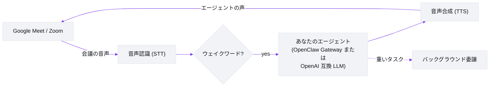

# Meetmate

[English](https://github.com/caty-ai/meetmate/blob/main/README.md) | **日本語** | [中文](https://github.com/caty-ai/meetmate/blob/main/docs/i18n/README.zh.md) | [ไทย](https://github.com/caty-ai/meetmate/blob/main/docs/i18n/README.th.md)

> この文書は [README.md](https://github.com/caty-ai/meetmate/blob/main/README.md)（英語・正本）の翻訳です。内容に乖離がある場合は英語版が優先されます。

[](https://github.com/caty-ai/meetmate/actions/workflows/test.yml)
[](https://github.com/caty-ai/meetmate/blob/main/LICENSE)
[](https://www.npmjs.com/package/meetmate)
[](https://nodejs.org/)
[](#何ができるのか)
[](#クイックスタート)

<picture>
  <source media="(prefers-color-scheme: dark)" srcset="https://raw.githubusercontent.com/caty-ai/meetmate/main/docs/images/hero-dark.svg">
  
</picture>

**あなたのAIエージェントを、Google Meet にも Zoom にも Discord のボイスチャンネルにも。声で話せる、本物の参加者として。**

Meetmate がやることはひとつだけ。**あなたの**エージェントに、会議の席を用意することです。顔と声を持った参加者として入室し、名前を呼べば答え、頼めばやってくれる。あえてそれ以上のことはせず、そのひとつを徹底的に磨きました。

## クイックスタート

**必要なもの:** [Node.js](https://nodejs.org/) ≥ 26 ・ [Attendee](https://attendee.dev/) アカウント（Meet/Zoom 用）または [Discord bot token](https://github.com/caty-ai/meetmate/blob/main/docs/setup-guide.md#discord-ボット音声チャンネル参加)（Discord — Attendee もトンネルも不要） ・ 音声認識用の [Soniox](https://soniox.com/)（または [Deepgram](https://deepgram.com/)） ・ TTS プロバイダー（[Fish Audio](https://fish.audio/)・ElevenLabs・OpenAI 互換のいずれか） ・ LLM エンドポイント（[OpenClaw Gateway](https://openclaw.ai/) または任意の OpenAI 互換） ・ 通常は [ngrok](https://ngrok.com/) か [Tailscale](https://tailscale.com/)（Meet/Zoom 用） ・ そして Google Meet はボットの入室許可を求めてきます。サードパーティサービスは有料の場合があります。

空のフォルダーで:

```bash
npm install meetmate
npx meetmate init     # ウィザードが API キー・ボイスID・LLM エンドポイントを集めて、それぞれの取得方法も教えてくれます
npx meetmate start    # サーバーを起動し、設定 UI の URL を表示します
```

表示された URL を開きます。これは設定 UI であり、まだダッシュボードではありません。必須項目が空のまま（あるいは `init` を丸ごとスキップした）場合でもサーバーは起動しますが、「セットアップ中」というバナーが足りないものを教えてくれます。埋めて **変更を保存** をクリックし、再起動してください。1つだけブラウザから埋められない例外があります — LLM 接続情報（Gateway の URL/Token、または OpenAI互換キー）は環境変数専用で、`init` ウィザードが `.env` に書き込みます。`init` を飛ばした場合は `.env` に自分で追加してください。読み込みが終わったら、同じホストの `/` でダッシュボードを開き、Meet または Zoom の URL を貼り付けて **「Meet に参加させる」** をクリックします（[実際の画面はこちら](#画面はこんな感じ)）。Meet 側でボットの「参加をリクエスト」を承認してから、ウェイクワードで呼びかけて話し始めてください。（Discord は URL ではなく、同じダッシュボードで Discord transport を選んでサーバー ID とボイスチャンネル ID を入力する — bot の作成は[セットアップガイドの Discord セクション](https://github.com/caty-ai/meetmate/blob/main/docs/setup-guide.md#discord-ボット音声チャンネル参加)を参照。）ngrok/Tailscale と Meet の入室承認は手動のままです。詳しい手順はウィザードの締めのメッセージと[セットアップガイド](https://github.com/caty-ai/meetmate/blob/main/docs/setup-guide.md)で確認できます。

## 何ができるのか

- **議事録ボットではなく、参加者です。** 参加者グリッドに自分のアバターで並び、部屋の会話を聞き、声で話します。ウェイクワード検出とバージイン対応（話しかぶせると、ちゃんと黙ります。バージインは Meet/Zoom のみ — Discord 経路には含まれません）。
- **「あなたの」エージェントが来ます。** ふだん使っているエージェントを、記憶も性格もスキルもそのままに接続（OpenClaw Gateway 経由）。チームが知っている「いつものあの子」が、そのまま会議室に入ってくる。だから Meetmate は一台ごとに個性が違います。（Gateway がなくても、任意の OpenAI 互換エンドポイントで動きます — 素の LLM+組み込みペルソナのシンプル構成。詳細は [LLM providers](https://github.com/caty-ai/meetmate/blob/main/docs/TECHNICAL.md#llm-providers)）
- **その場で頼めます。** 「今の議論まとめてチャンネルに投稿しといて」——重い作業は自動でバックグラウンドのセッションに委譲されるので、エージェントは会話に残ったままタスクが進みます。
- **「普通にできる」が製品です。** プッシュトゥトーク不要、特別なコマンド不要、気まずい沈黙もなし。同僚に話しかけるのと同じように話す——それが当たり前に感じられることこそ、磨いた部分です。
- **会議はどこでも、サーバーもどこでも。** 会議側は Google Meet・Zoom・Discord のボイスチャンネル、サーバー側は Windows / macOS / Linux。設定ファイルと API キーを用意して、コマンド1発（アバター画像はお好みで差し替え可能）。

## 画面はこんな感じ

画面は1つ、やることも1つ——エージェントを会議室に入れるだけ。これはダッシュボードで、`/` にあります。セットアップが完了していれば、ヘッダーの ⚙ リンクをクリックするだけで設定 UI（`npx meetmate start` が実際に URL を表示する画面）にワンクリックで移動できます。


1. **起動する。** セットアップが終わっていれば、`/` を開くとこの画面が迎えてくれます。大きな入力欄に会議情報を入れるまで、**参加ボタン**は押せません。
2. **招待文を貼る。** Meet / Zoom の URL 単体でも、**カレンダーの招待文をまるごと**でもOK。Meetmate が URL を自動抽出して（緑の「検出済み」表示）、参加ボタンが有効になります。

   

3. **参加させて、入室待ち。** クリックした瞬間に通話中カードが現れます。タイマーはこの時点から回り始め、WS 接続状態とエージェント名が並びます。bot は起動（🔄 起動中...）→ Meet へ入室リクエスト → 入室が許可されると WS 表示が「接続 OK」に変わります。

   

4. **Meet 側で承認する。** 唯一の手動ステップ。ほかのゲストと同じように bot の「参加をリクエスト」を承認したら、あとはウェイクワードで呼びかけるだけです。

同じ流れを API キーの取得から最初の挨拶まで詳しく追った版は[セットアップガイド](https://github.com/caty-ai/meetmate/blob/main/docs/setup-guide.md)にあります。

**ブラウザから設定する。** 日常的な調整はすべて同じ設定 UI の裏にあります——ベンダーキー、ウェイクワード、挨拶文、ボイスプリセット、接続テストなど——タブごとに整理され、各項目には変更が即時反映されるか再起動が必要かの注記が付いています。リポジトリをクローンしたり JSON を手編集したりする必要はありません。Gateway の URL/Token のような接続系の値（と自動生成の共有トークン）だけは、環境変数として `.env` に残ります。


タブごとの詳しい内訳は[設定リファレンス](https://github.com/caty-ai/meetmate/blob/main/docs/setup-guide.md#設定リファレンスsettings-ui)を参照してください。

## 会議はこんな感じ

名前を呼んだ瞬間から、退室するまで:

- ウェイクワードを呼びかけると——起き上がって、聞き始めます。
- 入室時に一度だけ挨拶し、そのあとは話しかけられるまで静かにしています。
- 会議の最中は、同僚に話しかけるように——質問したり、何かを調べさせたり、Slack にメモを残すよう頼んだり、タスクの管理を任せたりできます。
- お別れを言えば、短い挨拶を返してから通話を退出します。
- 通話後、Slack を接続していれば、要約と拾い上げたアクションアイテムがすでにそこで待っています。

会議中の、ちょっとしたやり取り:

```
あなた:   「Meetmate、料金ページが月曜からどう変わったか確認できる?」
Meetmate: [soft voice] 了解です、確認しますね。
          ...数秒後...
Meetmate: [warm] 変更点は2つです——年間割引が15%になったのと、新しく
          エンタープライズプランが追加されました。差分をチャンネルに投稿しましょうか?
```

## 現在のステータス

| 領域 | 現状 | 備考 |
|---|---|---|
| OpenClaw Gateway | 対応済み | 現状のメインパス：記憶・スキル・ツール・委譲はすべて既存のエージェント側に残ります。 |
| OpenAI 互換ベースライン | 対応済み | 任意の互換エンドポイント向けのシンプルな音声エージェントモード。 |
| OpenAI 互換ゲートウェイ経由の Claude Code | 対応済み | 2026年8月30日、Claude Code を頭脳にした実際の Google Meet でエンドツーエンド検証済み（[スモーク記録](https://github.com/caty-ai/meetmate/blob/main/docs/claude-code-smoke-test-2026-08-30.md)）— 参加・指名音声ターン・文脈・退出コマンド・会議後サマリーのすべてが、状態を持つ Claude Code ゲートウェイに対して汎用の `openai-compatible` プロバイダー経由で動作しました。Claude 専用のプロバイダー分岐はありません。注意: ボットは発話中に割り込まれても話を止めません（発話中は相手の音声入力がゲートされます）。配線の詳細: [セットアップガイド — 状態を持つゲートウェイ](https://github.com/caty-ai/meetmate/blob/main/docs/setup-guide.md#3-envgateway-接続情報環境専用値)。 |
| Hermes api_server | 対応済み | 2026年8月29日、実際の Google Meet でエンドツーエンド検証済み（[#76](https://github.com/caty-ai/meetmate/issues/76)）— 汎用の `openai-compatible` プロバイダー（SSH トンネル・Bearer 認証）経由で、実会議での音声会話が動作しました。対象は音声エージェント経路です。配線の詳細: [LLM providers](https://github.com/caty-ai/meetmate/blob/main/docs/TECHNICAL.md#llm-providers)。 |
| Codex / Kimi Code | 計画中 | まだ配線されていません。 |
| 会議グリッド内のアバター | 既定は静止画・ライブアバター実験2種あり | フレーム差し替えリップシンクが v8.4.0 で出荷済み、2.5D リグの PoC も main に入りました。既定は静止画のままで、ライブアバターの作業は [#2](https://github.com/caty-ai/meetmate/issues/2) で継続中です。 |

アバターを動かしたい場合は、すでに2つの実験が出荷済みです。発話に合わせて6枚の PNG を差し替えるフレーム式リップシンクアバター（v8.4.0）と、2.5D リグの PoC です。既定は静止画のまま — フレーム式の試し方は[セットアップガイドのフレーム差し替えアバターの節](https://github.com/caty-ai/meetmate/blob/main/docs/setup-guide.md#実験的なフレーム差し替えアバター)にあります（Fish Audio TTS と公開 HTTPS origin が必要）。リグ PoC の利用手順はまだ文書化されていません。

## プラットフォームに関する注意

| トピック | 現状 |
|---|---|
| Google Meet | メインの対応パス。まずはここから。 |
| Zoom | 自分がホスト/管理する会議では現状動作します。外部主催の Zoom 会議・OBF・管理された OAuth 設定への対応はまだ想定しないでください。 |
| Discord のボイスチャンネル | この初回リリースでは**自分が管理するサーバーのみ**。公式 Bot API（discord.js）を使用 — Attendee もトンネルも不要（bot が外向きに接続します）。ギルドの allowlist は fail-closed（空の場合は全ての参加を拒否）、intents/permissions は最小構成が前提です。参加時は音声キャプチャの前に必ず自己アナウンスします。退出はダッシュボードのボタンから行ってください — Discord 上の音声退出コマンドは現在検証中です([#139](https://github.com/caty-ai/meetmate/issues/139))。バージイン(話しかぶせによる割り込み停止)は、このリリースでは Discord 経路には含まれません。Discord 経路は現時点で Fish Audio TTS が必須です。 セットアップ: [セットアップガイドの Discord bot セクション](https://github.com/caty-ai/meetmate/blob/main/docs/setup-guide.md#discord-ボット音声チャンネル参加)。 |
| サーバー OS と自動起動 | Windows（WSL2 経由）・macOS・Linux でサーバーを動かせます。常駐サービスの登録はインストーラ1本: `scripts/install-service.sh` が macOS では launchd、Linux/WSL2 では systemd user unit を設定します（WSL2 は `/etc/wsl.conf` に `systemd=true` が必要。ngrok は WSL2 の中で動かすか、`server.ngrokDomain` を明示してください）。詳細: [セットアップガイド — 常駐サービス](https://github.com/caty-ai/meetmate/blob/main/docs/setup-guide.md#常駐サービス自動起動)。 |
| MCP と音声ブレイン | Meetmate の MCP サーバーは `join` / `leave` / `status` のコントロールプレーンです。音声ブレインは別物で、あなたの本物のエージェントは OpenClaw または別の OpenAI 互換ゲートウェイの裏側で動き、会議で話します。 |

## 必要なもの

`init` ウィザードが API キー・ボイスID・LLM エンドポイントの入力を代わりに済ませてくれます。ngrok/Tailscale と Meet の入室承認だけは手動のままです。この表は、各項目が何であり、いつ必要になるかのリファレンスです。

| 項目 | 目的 | 設定名 | 必要なタイミング | 備考 |
|---|---|---|---|---|
| [Node.js](https://nodejs.org/) 26+ | サーバーを実行 | `node`, `npm` | 常に | 必須。 |
| [Attendee](https://attendee.dev/) アカウント + API キー | 会議ボットの参加/退出 + 音声入出力 | `ATTENDEE_API_KEY` | Meet / Zoom | ホスティングサービス。現在の無料/有料プランの提供状況を確認してください。Discord 経路では未使用。 |
| Discord bot token | ボイスチャンネル用 bot の識別情報 | `discord_bot_token`(設定 UI、マスク表示) / `DISCORD_BOT_TOKEN` | Discord | [Developer Portal](https://discord.com/developers/applications) で最小限の intents/permissions で bot を作成してください。bot のアバターもここで設定します。[セットアップガイド](https://github.com/caty-ai/meetmate/blob/main/docs/setup-guide.md#discord-ボット音声チャンネル参加)。 |
| [Soniox](https://console.soniox.com/) アカウント + API キー | デフォルトの音声認識 | `STT_PROVIDER=soniox`, `SONIOX_API_KEY` | 通常 | デフォルトの経路。料金・トライアル条件は変わることがあります。 |
| [Deepgram](https://console.deepgram.com/signup) アカウント + API キー | 代替の音声認識（任意） | `STT_PROVIDER=deepgram`, `DEEPGRAM_API_KEY` | 任意 | Soniox から切り替える場合のみ。 |
| [Fish Audio](https://fish.audio/) アカウント + ボイス | 既定の音声合成 | `TTS_PROVIDER=fish-audio`, `FISH_AUDIO_API_KEY`, `FISH_AUDIO_VOICE_ID` | 既定 | 既存設定は変更なしでこのプロバイダーを使い続けます。 |
| [ElevenLabs](https://elevenlabs.io/) アカウント + ボイス | 代替の音声合成 | `TTS_PROVIDER=elevenlabs`, `ELEVENLABS_API_KEY`, `ELEVENLABS_VOICE_ID` | 任意 | モデルは設定 UI で指定し、PCM 出力は TTS サンプルレートに合わせます。 |
| OpenAI 互換 TTS | OpenAI またはローカルの音声合成 | `TTS_PROVIDER=openai-compatible`, `OPENAI_COMPATIBLE_TTS_BASE_URL`, `OPENAI_COMPATIBLE_TTS_MODEL`, `OPENAI_COMPATIBLE_TTS_VOICE` | 任意 | `api.openai.com` ではキー必須。Irodori-TTS など既定外のローカルサーバーでは省略でき、PCM は 24 kHz が必要です。 |
| [OpenClaw Gateway](https://openclaw.ai/) または他の OpenAI 互換 LLM ゲートウェイ | 実際の音声ブレイン | `LLM_PROVIDER`, `OPENCLAW_GATEWAY_URL`, `OPENCLAW_GATEWAY_TOKEN`、または `OPENAI_COMPATIBLE_BASE_URL`, `OPENAI_COMPATIBLE_API_KEY` | 常に | OpenClaw がメインの経路です。ステートフルな OpenAI 互換ゲートウェイについてはセットアップガイドに記載しています。 |
| [ngrok](https://ngrok.com/) または [Tailscale](https://tailscale.com/) | ボットの WebSocket を外部から到達可能にする | ngrok の場合は `server.ngrokDomain` | 条件付き | `ngrok` が一般的な経路です。ネットワークと Attendee のデプロイ構成が許せば Tailscale も選べます。料金・無料プランの詳細は変わることがあります。 |
| ボットの入室を許可する Google Meet の権限 | ボットを会議に入れる | Meet UI の「参加をリクエスト」承認 | Google Meet | Meet 側で参加リクエストを承認する必要があります。 |
| [Zoom Marketplace](https://marketplace.zoom.us/) アプリ/管理者設定 | Zoom ボットの権限モデル | Attendee/Zoom 側のアプリ設定 | Zoom のみ | 条件付き。外部主催の会議や管理された OAuth への対応はうたっていません。 |

キー類は `init` ウィザードか設定 UI から入力してください — ベンダーキー（Soniox / Deepgram / Fish Audio / ElevenLabs / OpenAI 互換 TTS / Attendee / Slack）は `config.json`（パーミッション 0600 で生成）に、LLM 接続系の値（Gateway の URL/Token・OpenAI互換 LLM キー）は `.env` に保存されます。どちらのファイルもコミットしないでください。シークレットのスクリーンショットや、有効な認証情報が入った共有設定ファイルも同様です。

ツール呼び出しが可能な OpenAI 互換ゲートウェイを接続する場合は、その経路をローカルかつ信頼できる範囲にとどめてください。Meetmate の信頼オプトインは、信頼できるローカルゲートウェイによる信頼できる会議でのみ利用を想定しています。外部の、あるいは信頼できない会議では、このモードは対応外のままです。

<a id="from-source"></a>

## ソースから起動（コントリビューター向け）

```bash
git clone git@github.com:caty-ai/meetmate.git
cd meetmate
npm install
cp .env.example .env && cp config.json.example config.json   # キーを記入
npm start
```

## なぜ作ったのか

会議は、人間が実際に協働する場所です。決定も、ニュアンスも、声のトーンも、「あ、あとひとつだけ」の瞬間も、全部そこにある。あなたのエージェントがチャット欄の中にしかいないなら、それらを全部見逃していることになります。

私たちは、エージェントは人間と同じ場所に座るべきだと考えています。通話の隅にいる文字起こしボットとしてではなく、グリッドの中の同僚として——そこにいて、呼びかけられて、役に立つ存在として。そして来るのが「あなたの」エージェントである以上、記憶も性格もその子のものです。「AIが会議に入った」と「**あの子**が会議に入った」の違いは、そこから生まれます。

Meetmate は意図的に小さな道具です。会議の進行を仕切ったりはしないし、商談を採点したりも、カレンダーの代わりになろうともしません。あなたのエージェントを部屋に連れて行く。その先は、あなたとその子の話です。

## 仕組み



1エージェント = 1サーバーインスタンス。サーバーが会議の音声を音声パイプライン（音声認識 → あなたのエージェントの LLM → 音声合成）へ橋渡しし、返答を通話へストリームで返します——会話として成立する速さで。

アーキテクチャ・モジュール構成・プロバイダ・音声仕様などの技術詳細は [docs/TECHNICAL.md](https://github.com/caty-ai/meetmate/blob/main/docs/TECHNICAL.md) にまとまっています。

## 設定

よくある調整の入口です。完全なリファレンスは [docs/operations.md](https://github.com/caty-ai/meetmate/blob/main/docs/operations.md) へ。

| やりたいこと | 見る場所 |
|---|---|
| 自分のエージェントをつなぐ（OpenClaw Gateway） | [セットアップガイド](https://github.com/caty-ai/meetmate/blob/main/docs/setup-guide.md) |
| 汎用の OpenAI 互換エンドポイントを使う | [TECHNICAL.md — LLM providers](https://github.com/caty-ai/meetmate/blob/main/docs/TECHNICAL.md#llm-providers) |
| 返答をもっと速くする | [Soniox チューニング](https://github.com/caty-ai/meetmate/blob/main/docs/operations.md#stt-プロバイダ切替soniox-チューニング) |
| 声・話速・TTS の挙動を変える | [音声プロファイル](https://github.com/caty-ai/meetmate/blob/main/docs/operations.md#音声プロファイルtts) |
| 重い作業をバックグラウンド委譲する | [委譲ハーネス](https://github.com/caty-ai/meetmate/blob/main/docs/operations.md#委譲強制ハーネス79) |
| 調子が悪いとき前の設定に戻す | [緊急 rollback 用 env](https://github.com/caty-ai/meetmate/blob/main/docs/operations.md#緊急-rollback-用-env) |
| Claude Code から会議を操作する（MCP） | [TECHNICAL.md — MCP server](https://github.com/caty-ai/meetmate/blob/main/docs/TECHNICAL.md#mcp-server-control-plane) |
| 本物の自分のエージェントを音声ブレインにする | [セットアップガイド](https://github.com/caty-ai/meetmate/blob/main/docs/setup-guide.md) |

うまく動かないときは[トラブルシューティング](https://github.com/caty-ai/meetmate/blob/main/docs/TECHNICAL.md#troubleshooting)へ。

## ドキュメント

| ドキュメント | 内容 |
|---|---|
| [docs/setup-guide.md](https://github.com/caty-ai/meetmate/blob/main/docs/setup-guide.md) | ゼロから初会議までのセットアップ手順 |
| [docs/TECHNICAL.md](https://github.com/caty-ai/meetmate/blob/main/docs/TECHNICAL.md) | 機能詳細・アーキテクチャ・プロバイダ・MCP・開発 |
| [docs/architecture.md](https://github.com/caty-ai/meetmate/blob/main/docs/architecture.md) | アーキテクチャ詳説 |
| [docs/operations.md](https://github.com/caty-ai/meetmate/blob/main/docs/operations.md) | 運用・チューニング完全リファレンス |
| [docs/deploy-checklist.md](https://github.com/caty-ai/meetmate/blob/main/docs/deploy-checklist.md) | デプロイチェックリスト |

## 開発ステータス

- **リリース**: 公開バージョンは [GitHub Releases](https://github.com/caty-ai/meetmate/releases) を参照してください。
- **進行中**: npm 配布・公開リリーストラック（[#3](https://github.com/caty-ai/meetmate/issues/3) / [#4](https://github.com/caty-ai/meetmate/issues/4)）

## コントリビュート

Issue・PR 歓迎です — [CONTRIBUTING.md](https://github.com/caty-ai/meetmate/blob/main/CONTRIBUTING.md) をご覧ください。Issue ファーストのフローと Conventional Commits を使っています。

## 謝辞

Meetmate は優れたサービスと OSS の上に成り立っています: [Attendee](https://attendee.dev/)（会議ボット基盤）・[Soniox](https://soniox.com/)（リアルタイム音声認識）・[Fish Audio](https://fish.audio/)（表現力のある音声合成）・[OpenClaw Gateway](https://openclaw.ai/)（エージェント基盤 — SOUL / 記憶 / スキル / ツール）、そして OpenAI 互換 LLM エコシステム。

## ライセンス

[MIT](https://github.com/caty-ai/meetmate/blob/main/LICENSE) — 帰属表示は [NOTICE](https://github.com/caty-ai/meetmate/blob/main/NOTICE) を参照してください。
