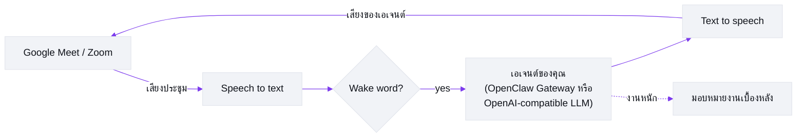

# Meetmate

[English](https://github.com/caty-ai/meetmate/blob/main/README.md) | [日本語](https://github.com/caty-ai/meetmate/blob/main/docs/i18n/README.ja.md) | [中文](https://github.com/caty-ai/meetmate/blob/main/docs/i18n/README.zh.md) | **ไทย**

> เอกสารนี้เป็นคำแปลของ [README.md](https://github.com/caty-ai/meetmate/blob/main/README.md) (ภาษาอังกฤษ ซึ่งเป็นฉบับหลัก) หากเนื้อหาต่างกัน ให้ยึดตามเวอร์ชันภาษาอังกฤษ

[](https://github.com/caty-ai/meetmate/actions/workflows/test.yml)
[](https://github.com/caty-ai/meetmate/blob/main/LICENSE)
[](https://www.npmjs.com/package/meetmate)
[](https://nodejs.org/)
[](#ทำอะไรได้บ้าง)
[](#เริ่มต้นอย่างรวดเร็ว)

<picture>
  <source media="(prefers-color-scheme: dark)" srcset="https://raw.githubusercontent.com/caty-ai/meetmate/main/docs/images/hero-dark.svg">
  
</picture>

**พา AI เอเจนต์ของคุณเข้าสู่ Google Meet และ Zoom — ในฐานะผู้เข้าร่วมตัวจริงที่พูดได้**

Meetmate ทำแค่สิ่งเดียว: จองที่นั่งในการประชุมให้ AI เอเจนต์*ของคุณ* มันเข้าร่วมในฐานะผู้เข้าร่วมที่มีทั้งหน้าและเสียง — เรียกชื่อมัน มันตอบ; ฝากอะไรไว้ มันจัดการให้ เราตั้งใจจำกัดขอบเขตไว้แค่นั้น แล้วขัดเกลาสิ่งเดียวนั้นให้เนียนที่สุด

## เริ่มต้นอย่างรวดเร็ว

**สิ่งที่คุณต้องมี:** Node.js ≥ 26 · บัญชี [Attendee](https://attendee.dev/) · [Soniox](https://soniox.com/) (หรือ [Deepgram](https://deepgram.com/)) สำหรับ speech-to-text · [Fish Audio](https://fish.audio/) สำหรับเสียงพูด (รวมถึง voice ID) · เอนด์พอยต์ LLM (OpenClaw Gateway หรือ OpenAI-compatible ใดก็ได้) · โดยปกติต้องมี [ngrok](https://ngrok.com/) หรือ [Tailscale](https://tailscale.com/) · และ Google Meet จะขอให้คุณอนุมัติให้บอทเข้าร่วม บริการจากบุคคลที่สามอาจมีค่าใช้จ่าย

ในโฟลเดอร์ว่าง:

```bash
npm install meetmate
npx meetmate init     # ตัวช่วยติดตั้งจะเก็บ API key, voice ID และ LLM endpoint ของคุณ — พร้อมบอกว่าจะไปหาแต่ละอย่างได้จากที่ไหน
npx meetmate start    # เริ่มเซิร์ฟเวอร์และพิมพ์ URL ของหน้าตั้งค่า
```

เปิด URL ที่แสดงขึ้นมา วาง URL ของ Meet หรือ Zoom แล้วคลิก **Join** ([ดูหน้าจอจริงได้ที่นี่](#หน้าตาเป็นแบบนี้)) อนุมัติคำขอ "Ask to join" ของบอทใน Meet — จากนั้นเรียก wake word แล้วเริ่มพูดได้เลย ขั้นตอน ngrok/Tailscale และการอนุมัติเข้าร่วมใน Meet ยังคงต้องทำเอง ข้อความปิดท้ายของตัวช่วยติดตั้งและ[คู่มือติดตั้ง](https://github.com/caty-ai/meetmate/blob/main/docs/setup-guide.md) จะแนะนำคุณตลอดขั้นตอนเหล่านี้

## ทำอะไรได้บ้าง

- **มันคือผู้เข้าร่วม ไม่ใช่บอทจดรายงานการประชุม** เอเจนต์ของคุณโผล่ในกริดผู้เข้าร่วมพร้อมอวาตาร์ของตัวเอง ฟังบทสนทนาในห้อง และพูด — พร้อมการตรวจจับ wake word และ barge-in (พูดแทรกได้เลย มันจะหยุดให้เอง)
- **มันคือเอเจนต์*ของคุณ*** เชื่อมเอเจนต์ที่คุณใช้อยู่แล้ว — พร้อมความจำ บุคลิก และทักษะครบถ้วน — ผ่าน OpenClaw Gateway "คนเดิม" ที่ทีมคุ้นเคยเดินเข้าห้องประชุมมาเลย จึงไม่มี Meetmate สองตัวไหนพูดเหมือนกัน (ไม่มี Gateway? ใช้เอนด์พอยต์ OpenAI-compatible อะไรก็ได้ เป็นโหมดพื้นฐานที่เรียบง่ายกว่า: LLM ธรรมดา + เพอร์โซนาในตัว — ดู [LLM providers](https://github.com/caty-ai/meetmate/blob/main/docs/TECHNICAL.md#llm-providers))
- **สั่งงานได้ทันทีตรงนั้น** "สรุปให้หน่อยว่าเราลงตัวตรงไหน แล้วโพสต์เข้าช่องด้วย" งานหนักจะถูกมอบหมายให้เซสชันเบื้องหลังโดยอัตโนมัติ เอเจนต์จึงอยู่คุยต่อได้ในขณะที่งานกำลังทำ
- **"ธรรมดา" คือประเด็น** ไม่ต้องกดค้างเพื่อพูด ไม่มีคำสั่งพิเศษ ไม่มีความเงียบที่น่าอึดอัด คุณคุยกับมันเหมือนคุยกับเพื่อนร่วมงาน — ความรู้สึก "ไม่มีอะไรพิเศษ" นั่นแหละคือผลิตภัณฑ์
- **ประชุมที่ไหนก็ได้ รันที่ไหนก็ได้** ฝั่งการประชุมคือ Google Meet และ Zoom ฝั่งเซิร์ฟเวอร์คือ Windows, macOS และ Linux แค่ไฟล์คอนฟิก คีย์ API และคำสั่งเดียว — จะเปลี่ยนรูปอวาตาร์ก็ได้ตามใจ

## หน้าตาเป็นแบบนี้

หนึ่งหน้าจอ หนึ่งหน้าที่ — พาเอเจนต์ของคุณเข้าห้องประชุม นี่คือหน้า settings UI ที่ `npx meetmate start` พิมพ์ URL ให้ (ป้ายกำกับบนหน้าจอยังเป็นภาษาญี่ปุ่น คำอธิบายด้านล่างบอกว่าแต่ละขั้นทำอะไร)


1. **เริ่ม** เปิด URL ที่พิมพ์ออกมาแล้วจะมาถึงหน้านี้ ช่องใหญ่ไว้ใส่ข้อมูลการประชุม ปุ่ม **Join** จะกดไม่ได้จนกว่าจะมีลิงก์
2. **วางคำเชิญ** จะเป็น URL ของ Meet / Zoom เปล่า ๆ หรือ**คำเชิญจากปฏิทินทั้งก้อน**ก็ได้ — Meetmate จะดึง URL การประชุมให้เอง (ข้อความสีเขียว "ตรวจพบ") แล้วเปิดปุ่ม Join ให้

   

3. **เข้าร่วมแล้วรอหน้าประตู** การ์ดเซสชันจะปรากฏ: แสดง 🟡 ระหว่างรอการอนุมัติ และตัวจับเวลาจะเริ่มเดินเมื่อบอทเข้าห้องแล้ว

   

4. **อนุมัติใน Meet** ขั้นตอนเดียวที่ต้องทำเอง ฝั่งคุณในสาย — อนุมัติคำขอ "ขอเข้าร่วม" ของบอทเหมือนแขกทั่วไป จากนั้นเรียกชื่อปลุก (wake word) แล้วเริ่มคุยได้เลย

   

ดูขั้นตอนเดียวกันแบบละเอียดตั้งแต่ API key จนถึงคำทักทายแรกได้ที่ [Setup guide](https://github.com/caty-ai/meetmate/blob/main/docs/setup-guide.md)

## สถานะปัจจุบัน

| พื้นที่ | สถานะปัจจุบัน | หมายเหตุ |
|---|---|---|
| OpenClaw Gateway | รองรับแล้ว | เส้นทางหลักในปัจจุบัน: ความจำ ทักษะ เครื่องมือ และการมอบหมายงานยังคงอยู่ที่เอเจนต์เดิมของคุณ |
| เบสไลน์ที่เข้ากันได้กับ OpenAI | รองรับแล้ว | โหมดเอเจนต์เสียงล้วนสำหรับเอนด์พอยต์ที่เข้ากันได้ใดก็ตาม |
| Claude Code ผ่านเกตเวย์ OpenAI-compatible | กำลังผสานรวม | ใช้ provider แบบทั่วไป `openai-compatible` ยังไม่มี provider เฉพาะสำหรับ Claude เราจะเรียกว่ารองรับก็ต่อเมื่อผ่านการทดสอบแบบ end-to-end จริงบน Google Meet แล้วเท่านั้น |
| Hermes api_server | ยืนยันเอนด์พอยต์แล้ว แต่การเชื่อมต่อฝั่ง Meetmate ยังค้างอยู่ | ณ วันที่ 12 กรกฎาคม 2026 issue [#1](https://github.com/caty-ai/meetmate/issues/1) ยืนยัน `POST /v1/chat/completions`, SSE, Bearer auth และการฉีด profile/persona แล้ว งานที่เหลือคือการส่งต่อ token และ smoke/E2E ของ Meetmate |
| Codex / Kimi Code | อยู่ในแผน | ยังไม่ได้เชื่อมต่อ |
| อวาตาร์ในกริดการประชุม | ปัจจุบันเป็นภาพนิ่ง | อวาตาร์แบบสดอยู่ในแผนที่ [#2](https://github.com/caty-ai/meetmate/issues/2) |

## หมายเหตุเกี่ยวกับแพลตฟอร์ม

| หัวข้อ | ความเป็นจริงในปัจจุบัน |
|---|---|
| Google Meet | เส้นทางหลัก เริ่มต้นที่นี่ก่อน |
| Zoom | ใช้งานได้กับการประชุมที่คุณโฮสต์/ควบคุมเองในตอนนี้ อย่าเพิ่งคาดหวังว่าจะรองรับการประชุม Zoom ที่โฮสต์จากภายนอก, OBF หรือการตั้งค่า OAuth แบบมีการจัดการ |
| MCP กับสมองเสียง | MCP server ของ Meetmate เป็น control plane สำหรับ `join` / `leave` / `status` ส่วนสมองเสียงแยกต่างหาก: เอเจนต์ตัวจริงของคุณทำงานอยู่หลัง OpenClaw หรือเกตเวย์ OpenAI-compatible อื่น และพูดในที่ประชุม |

## สิ่งที่คุณต้องมี

ตัวช่วยติดตั้ง `init` จะเก็บ API key, voice ID และ LLM endpoint ให้คุณ ส่วน ngrok/Tailscale และขั้นตอนการอนุมัติเข้าร่วมใน Meet ยังคงต้องทำเอง ตารางนี้คือข้อมูลอ้างอิงว่าแต่ละรายการคืออะไรและจำเป็นเมื่อไร

| รายการ | วัตถุประสงค์ | ชื่อการตั้งค่า | จำเป็นเมื่อไร | หมายเหตุ |
|---|---|---|---|---|
| Node.js 26+ | รันเซิร์ฟเวอร์ | `node`, `npm` | เสมอ | จำเป็น |
| บัญชี [Attendee](https://attendee.dev/) + API key | บอทเข้าร่วม/ออกจากการประชุม + รับส่งเสียง | `ATTENDEE_API_KEY` | เสมอ | บริการแบบโฮสต์; ตรวจสอบความพร้อมใช้งานแบบฟรี/เสียเงินในปัจจุบัน |
| บัญชี [Soniox](https://console.soniox.com/) + API key | speech-to-text ค่าเริ่มต้น | `STT_PROVIDER=soniox`, `SONIOX_API_KEY` | โดยปกติ | เส้นทางค่าเริ่มต้น เงื่อนไขราคา/ทดลองใช้อาจเปลี่ยนแปลง |
| บัญชี [Deepgram](https://console.deepgram.com/signup) + API key | speech-to-text ทางเลือก (ไม่บังคับ) | `STT_PROVIDER=deepgram`, `DEEPGRAM_API_KEY` | ไม่บังคับ | ใช้เฉพาะเมื่อเปลี่ยนจาก Soniox |
| บัญชี [Fish Audio](https://fish.audio/) + เสียง | เสียงสำหรับ text-to-speech | `FISH_AUDIO_API_KEY`, `FISH_AUDIO_VOICE_ID`, `TTS_PROVIDER=fish-audio` | เสมอ | voice ID มาจาก URL ของหน้าเสียง เงื่อนไขราคา/ทดลองใช้อาจเปลี่ยนแปลง |
| OpenClaw Gateway หรือเกตเวย์ LLM แบบ OpenAI-compatible อื่น | สมองเสียงตัวจริง | `LLM_PROVIDER`, `OPENCLAW_GATEWAY_URL`, `OPENCLAW_GATEWAY_TOKEN` หรือ `OPENAI_COMPATIBLE_BASE_URL`, `OPENAI_COMPATIBLE_API_KEY` | เสมอ | OpenClaw คือเส้นทางหลัก; เกตเวย์ OpenAI-compatible แบบ stateful มีเอกสารอยู่ในคู่มือติดตั้ง |
| [ngrok](https://ngrok.com/) หรือ [Tailscale](https://tailscale.com/) | ทำให้ WebSocket ของบอทเข้าถึงได้จากภายนอก | `server.ngrokDomain` สำหรับ ngrok | ตามเงื่อนไข | `ngrok` เป็นเส้นทางที่ใช้กันทั่วไป Tailscale เป็นทางเลือกเมื่อเครือข่ายและการดีพลอย Attendee ของคุณอนุญาต รายละเอียดราคา/แผนฟรีอาจเปลี่ยนแปลง |
| สิทธิ์ของ Google Meet ในการอนุมัติให้บอทเข้าร่วม | ให้บอทเข้าห้องประชุมได้ | การอนุมัติ "Ask to join" ใน Meet UI | Google Meet | คุณต้องอนุมัติคำขอเข้าร่วมใน Meet เอง |
| การตั้งค่าแอป/แอดมินใน [Zoom Marketplace](https://marketplace.zoom.us/) | โมเดลสิทธิ์ของบอทใน Zoom | การตั้งค่าแอปฝั่ง Attendee/Zoom | เฉพาะ Zoom | ตามเงื่อนไข ไม่รับประกันว่ารองรับการประชุมที่โฮสต์จากภายนอกหรือ OAuth แบบมีการจัดการ |

เก็บคีย์และโทเคนทั้งหมดไว้ใน `.env` (ส่วน apiKey ของ openai-compatible จะอยู่ใน `config.json` — ตัวช่วยติดตั้งจะเขียนลงตำแหน่งที่ถูกต้องให้เอง) อย่า commit ทั้งสองไฟล์นี้ รวมถึงภาพหน้าจอของความลับ หรือไฟล์คอนฟิกที่แชร์กันซึ่งมีข้อมูลรับรองที่ใช้งานได้จริง

หากคุณเชื่อมต่อเกตเวย์ OpenAI-compatible ที่เรียกใช้เครื่องมือได้ ให้จำกัดเส้นทางนั้นไว้ในเครื่องและเชื่อถือได้เท่านั้น ตัวเลือก trust opt-in ของ Meetmate ออกแบบมาเฉพาะสำหรับการประชุมที่เชื่อถือได้ร่วมกับเกตเวย์โลคัลที่เชื่อถือได้เท่านั้น การประชุมภายนอกหรือที่ไม่น่าเชื่อถือยังไม่รองรับโหมดนี้

<a id="from-source"></a>

## รันจากซอร์ส (สำหรับผู้ร่วมพัฒนา)

```bash
git clone git@github.com:caty-ai/meetmate.git
cd meetmate
npm install
cp .env.example .env && cp config.json.example config.json   # แล้วกรอก key ลงไป
npm start
```

## ทำไมเราถึงสร้างมันขึ้นมา

การประชุมคือที่ที่มนุษย์ร่วมมือกันจริงๆ — การตัดสินใจ นัยยะ น้ำเสียง และช่วงเวลาแบบ "เดี๋ยวนะ มีอีกเรื่อง" ถ้า AI เอเจนต์ของคุณอยู่แต่ในกล่องแชท มันพลาดทั้งหมดนั้นไป

เราเชื่อว่าเอเจนต์ควรนั่งตรงที่มนุษย์ของมันนั่ง ไม่ใช่เป็นบอทถอดเสียงที่ขอบสาย แต่เป็นเพื่อนร่วมงานในกริด: อยู่ตรงนั้น เรียกได้ ใช้งานได้จริง และเพราะมันคือเอเจนต์*ของคุณ* — พร้อมความจำและตัวตนของมันเอง — ความต่างมันอยู่ระหว่าง "มี AI เข้าสายมา" กับ "*เธอ*เข้าสายมา"

Meetmate เป็นเครื่องมือเล็กๆ โดยตั้งใจ มันไม่พยายามคุมการประชุมของคุณ ไม่ให้คะแนนสายของคุณ และไม่มาแทนปฏิทินของคุณ มันแค่พาเอเจนต์ของคุณเข้าห้อง ที่เหลือเป็นเรื่องของคุณสองคน

## มันทำงานอย่างไร



1 เอเจนต์ = 1 เซิร์ฟเวอร์อินสแตนซ์ เซิร์ฟเวอร์เชื่อมเสียงประชุมเข้ากับไปป์ไลน์เสียง (speech-to-text → LLM ของเอเจนต์คุณ → text-to-speech) แล้วสตรีมคำตอบกลับเข้าสาย — เร็วพอที่จะรู้สึกเหมือนบทสนทนาจริง

รายละเอียดเชิงวิศวกรรมทั้งหมด — สถาปัตยกรรม แผนที่โมดูล ผู้ให้บริการ สเปกเสียง — อยู่ใน [docs/TECHNICAL.md](https://github.com/caty-ai/meetmate/blob/main/docs/TECHNICAL.md)

## การตั้งค่า

จุดเริ่มต้นสำหรับการปรับแต่งที่พบบ่อย อ้างอิงฉบับเต็มอยู่ที่ [docs/operations.md](https://github.com/caty-ai/meetmate/blob/main/docs/operations.md)

| ฉันอยาก… | ดูที่ |
|---|---|
| เชื่อมเอเจนต์ของตัวเอง (OpenClaw Gateway) | [คู่มือติดตั้ง](https://github.com/caty-ai/meetmate/blob/main/docs/setup-guide.md) |
| ใช้เอนด์พอยต์ OpenAI-compatible ทั่วไป | [TECHNICAL.md — LLM providers](https://github.com/caty-ai/meetmate/blob/main/docs/TECHNICAL.md#llm-providers) |
| ให้ตอบกลับเร็วขึ้น | [การปรับจูน Soniox](https://github.com/caty-ai/meetmate/blob/main/docs/operations.md#stt-プロバイダ切替soniox-チューニング) |
| เปลี่ยนเสียง ความเร็ว หรือพฤติกรรม TTS | [โปรไฟล์เสียง](https://github.com/caty-ai/meetmate/blob/main/docs/operations.md#音声プロファイルtts) |
| ใช้การมอบหมายงานเบื้องหลังสำหรับงานหนัก | [Delegation harness](https://github.com/caty-ai/meetmate/blob/main/docs/operations.md#委譲強制ハーネス79) |
| ย้อนกลับไปการตั้งค่าก่อนหน้าเมื่อมีปัญหา | [Env สำหรับ rollback ฉุกเฉิน](https://github.com/caty-ai/meetmate/blob/main/docs/operations.md#緊急-rollback-用-env) |
| ควบคุมการประชุมจาก Claude Code (MCP) | [TECHNICAL.md — MCP server](https://github.com/caty-ai/meetmate/blob/main/docs/TECHNICAL.md#mcp-server-control-plane) |
| ให้เอเจนต์ตัวจริงของคุณเป็นสมองเสียง | [คู่มือติดตั้ง](https://github.com/caty-ai/meetmate/blob/main/docs/setup-guide.md) |

มีอะไรไม่ทำงาน? ดู[การแก้ไขปัญหา](https://github.com/caty-ai/meetmate/blob/main/docs/TECHNICAL.md#troubleshooting)

## เอกสาร

| เอกสาร | เนื้อหา |
|---|---|
| [docs/setup-guide.md](https://github.com/caty-ai/meetmate/blob/main/docs/setup-guide.md) | จากศูนย์ถึงการประชุมครั้งแรก ทีละขั้นตอน |
| [docs/TECHNICAL.md](https://github.com/caty-ai/meetmate/blob/main/docs/TECHNICAL.md) | ฟีเจอร์แบบละเอียด สถาปัตยกรรม ผู้ให้บริการ MCP การพัฒนา |
| [docs/architecture.md](https://github.com/caty-ai/meetmate/blob/main/docs/architecture.md) | เจาะลึกสถาปัตยกรรม |
| [docs/operations.md](https://github.com/caty-ai/meetmate/blob/main/docs/operations.md) | อ้างอิงการดำเนินงานและการปรับจูนฉบับเต็ม |
| [docs/deploy-checklist.md](https://github.com/caty-ai/meetmate/blob/main/docs/deploy-checklist.md) | เช็กลิสต์การ deploy |

> ℹ️ เอกสารบางส่วนใน `docs/` ยังเป็นภาษาญี่ปุ่น ตารางอ้างอิงและคำสั่งต่าง ๆ ใช้ได้โดยไม่ขึ้นกับภาษา

## สถานะโปรเจกต์

- **รีลีส**: ดูเวอร์ชันที่เผยแพร่แล้วได้ที่ [GitHub Releases](https://github.com/caty-ai/meetmate/releases)
- **กำลังดำเนินการ**: การแจกจ่ายผ่าน npm และเส้นทาง public release ([#3](https://github.com/caty-ai/meetmate/issues/3) / [#4](https://github.com/caty-ai/meetmate/issues/4))

## การมีส่วนร่วม

ยินดีรับ Issue และ PR — ดู [CONTRIBUTING.md](https://github.com/caty-ai/meetmate/blob/main/CONTRIBUTING.md) เราใช้ flow แบบ issue-first และ Conventional Commits

## กิตติกรรมประกาศ

Meetmate ยืนอยู่บนบริการและ OSS ที่ยอดเยี่ยม: [Attendee](https://attendee.dev/) (โครงสร้างพื้นฐานบอทประชุม), [Soniox](https://soniox.com/) (STT แบบเรียลไทม์), [Fish Audio](https://fish.audio/) (TTS ที่สื่ออารมณ์), OpenClaw Gateway (โครงสร้างพื้นฐานเอเจนต์ — SOUL / ความจำ / ทักษะ / เครื่องมือ) และระบบนิเวศของ OpenAI-compatible LLM

## สัญญาอนุญาต

[MIT](https://github.com/caty-ai/meetmate/blob/main/LICENSE) — ดูการระบุแหล่งที่มาได้ที่ [NOTICE](https://github.com/caty-ai/meetmate/blob/main/NOTICE)
