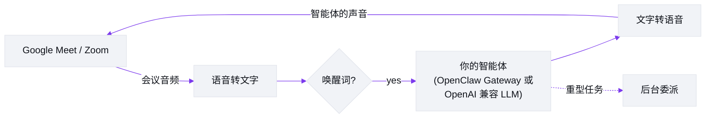

# Meetmate

[English](https://github.com/caty-ai/meetmate/blob/main/README.md) | [日本語](https://github.com/caty-ai/meetmate/blob/main/docs/i18n/README.ja.md) | **中文** | [ไทย](https://github.com/caty-ai/meetmate/blob/main/docs/i18n/README.th.md)

> 本文档是 [README.md](https://github.com/caty-ai/meetmate/blob/main/README.md)(英文版,为正本)的翻译。如内容出现不一致,以英文版为准。

[](https://github.com/caty-ai/meetmate/actions/workflows/test.yml)
[](https://github.com/caty-ai/meetmate/blob/main/LICENSE)
[](https://www.npmjs.com/package/meetmate)
[](https://nodejs.org/)
[](#它能做什么)
[](#快速上手)

<picture>
  <source media="(prefers-color-scheme: dark)" srcset="https://raw.githubusercontent.com/caty-ai/meetmate/main/docs/images/hero-dark.svg">
  
</picture>

**把你的 AI 智能体带进 Google Meet 和 Zoom —— 作为一名真正能开口说话的参会者。**

Meetmate 只做一件事:给*你的* AI 智能体在会议里留一个座位。它以有头像、有声音的参会者身份加入——你叫它的名字,它会回应;你交代事情,它会办妥。我们刻意把范围收得这么小,然后把这一件事打磨到极致。

## 快速上手

**你需要准备:** [Node.js](https://nodejs.org/) ≥ 26 · [Attendee](https://attendee.dev/) 账号 · 用于语音转文字的 [Soniox](https://soniox.com/)(或 [Deepgram](https://deepgram.com/)) · 用于语音合成的 [Fish Audio](https://fish.audio/)(包含语音 ID) · 一个 LLM 端点([OpenClaw Gateway](https://openclaw.ai/) 或任意 OpenAI 兼容端点) · 通常还需要 [ngrok](https://ngrok.com/) 或 [Tailscale](https://tailscale.com/) · 另外 Google Meet 会要求你批准机器人加入。第三方服务可能需要付费。

在一个空文件夹中:

```bash
npm install meetmate
npx meetmate init     # 向导会收集你的 API 密钥、语音 ID 和 LLM 端点 —— 并告诉你去哪里获取每一项
npx meetmate start    # 启动服务器并打印设置界面 URL
```

打开打印出来的 URL——这是设置界面,还不是仪表盘。如果还有必填项为空(或者你完全跳过了 `init`——服务器仍会启动,只是进入设置模式),你会看到一条「セットアップ中」（即“设置中”）横幅,提示缺少什么;填好后点击「変更を保存」（即“保存更改”）,再重启。有一个例外无法在浏览器里填写:LLM 连接值（网关 URL/Token,或 OpenAI 兼容密钥）只能来自环境变量——`init` 向导会替你写进 `.env`;如果你跳过了 `init`,请自行把它们加到 `.env`。加载完成后,打开同一主机的 `/` 进入仪表盘,粘贴 Meet 或 Zoom 链接,点击 **Join**（[界面预览见这里](#界面长什么样)）。在 Meet 中批准机器人的“Ask to join”请求——然后叫它的唤醒词,开始说话。ngrok/Tailscale 和 Meet 的入会批准步骤仍需手动完成;向导结束时的提示和[安装指南](https://github.com/caty-ai/meetmate/blob/main/docs/setup-guide.md)会带你走完这些步骤。

## 它能做什么

- **它是参会者,不是会议纪要机器人。** 你的智能体带着自己的头像出现在参会者网格里,听会场讨论,开口说话——支持唤醒词检测和插话打断(你直接盖过它说话,它就会乖乖停下来)。
- **它是“你的”智能体。** 通过 OpenClaw Gateway,接入你已经在用的那个智能体——连同它的记忆、性格和技能。团队熟悉的那个“老搭档”,就这样走进会议室,所以没有两个 Meetmate 说话是一个味儿的。(没有 Gateway?任何 OpenAI 兼容端点也能用,作为更简单的基线:普通 LLM + 内置人设——见 [LLM providers](https://github.com/caty-ai/meetmate/blob/main/docs/TECHNICAL.md#llm-providers)。)
- **当场就能派活。** “把刚才讨论的结论总结一下,发到频道里。”重活会自动委派给后台会话,所以智能体一边继续参与对话,任务一边推进。
- **“平平无奇”正是卖点。** 不用按键发言,没有特殊命令,没有尴尬的沉默。你像跟同事说话一样跟它说话——这种“没什么特别”的感觉,本身就是产品。
- **在哪开会都行,在哪运行都行。** 会议侧支持 Google Meet 和 Zoom;服务器侧支持 Windows、macOS 和 Linux。一份配置、几个 API 密钥、一条命令——头像图片想换就换。

## 界面长什么样

一个界面，一件事——把你的智能体送进会议室。这是仪表盘，就在 `/`——设置完成后，只需点击页眉里的 ⚙ 链接，一步就能到达设置界面（也就是 `npx meetmate start` 实际打印 URL 的那个界面）。（界面文字目前为日语，下面的说明会告诉你每一步在做什么。）


1. **启动。** 设置完成后，打开 `/` 就会看到这个界面来迎接你。大输入框用来放会议信息；在此之前**加入按钮**保持禁用。
2. **粘贴邀请。** 单独的 Meet / Zoom URL 可以，**整段日历邀请原样粘贴**也可以——Meetmate 会自动提取会议 URL（绿色的「検出済み」提示，即"已检测到"），并激活加入按钮。

   

3. **加入并等待放行。** 点击的瞬间就会出现会话卡片——计时器从此刻开始走动，旁边是 WS 连接状态和智能体名字。机器人先启动（🔄 起動中...），向 Meet 请求入会；进入房间后 WS 状态变为已连接。

   

4. **在 Meet 里批准。** 唯一的手动步骤，在你这一侧完成——像批准普通访客一样批准机器人的"请求加入"。然后喊它的唤醒词，开始对话。

从 API 密钥到第一声问候的完整流程，见[设置指南](https://github.com/caty-ai/meetmate/blob/main/docs/setup-guide.md)。

**在浏览器里配置。** 日常需要调整的一切都在同一个设置界面背后——服务商密钥、唤醒词、问候语、语音预设、连接测试——按标签页分类，每个字段都会注明改动是即时生效还是需要重启。不用克隆仓库，也不用手改 JSON；只有网关 URL/Token 这类连接值（以及少数自动生成的令牌）仍以环境变量的形式留在 `.env` 中。


完整的分标签页说明见[设置参考](https://github.com/caty-ai/meetmate/blob/main/docs/setup-guide.md#設定リファレンスsettings-ui)。

## 开会时是什么感觉

从你叫出它的名字，到它离开会议，大概是这样:

- 你说出唤醒词——它就醒了，开始倾听。
- 加入时它会打个招呼，之后就安静下来，直到你叫它。
- 开会过程中，像跟同事说话一样跟它说话:问它问题、让它查点东西、让它在 Slack 里留个备注，或者把一项任务交给它跟进。
- 跟它道别，它会说一句简短的告别语，然后退出通话。
- 会议结束后，如果你接入了 Slack，总结和捕捉到的行动项已经在那边等你了。

会议中的一段简短对话:

```
你:       "Meetmate，能看看定价文档从周一到现在有什么变化吗?"
Meetmate: [soft voice] 好的，马上查。
          ...几秒后...
Meetmate: [warm] 有两处变化——年度折扣改成了 15%，还新增了一个
          企业版套餐。要我把改动发到频道里吗?
```

## 当前状态

| 领域 | 现状 | 备注 |
|---|---|---|
| OpenClaw Gateway | 已支持 | 目前的主路径：记忆、技能、工具和委派都留在你现有的智能体上。 |
| OpenAI 兼容基线 | 已支持 | 面向任意兼容端点的纯语音智能体模式。 |
| 通过 OpenAI 兼容网关接入 Claude Code | 已支持 | 2026年8月30日,以 Claude Code 作为大脑在真实 Google Meet 中完成端到端验证([冒烟测试记录](https://github.com/caty-ai/meetmate/blob/main/docs/claude-code-smoke-test-2026-08-30.md))— 入会、指名语音轮次、上下文、退出指令、会后摘要全部通过通用的 `openai-compatible` 提供方对接有状态的 Claude Code 网关运行。没有 Claude 专属的提供方分支。注意:机器人说话时不会因被打断而停止(其发言期间会屏蔽对方的音频输入)。接线说明:[安装指南 — 有状态网关](https://github.com/caty-ai/meetmate/blob/main/docs/setup-guide.md#3-envgateway-接続情報環境専用値)。 |
| Hermes api_server | 已支持 | 2026 年 8 月 29 日已在真实 Google Meet 中完成端到端验证（[#76](https://github.com/caty-ai/meetmate/issues/76)）——通过通用的 `openai-compatible` 提供方（SSH 隧道、Bearer 认证），真实会议中的语音对话运行正常。此项覆盖语音智能体路径。接线细节: [LLM providers](https://github.com/caty-ai/meetmate/blob/main/docs/TECHNICAL.md#llm-providers)。 |
| Codex / Kimi Code | 计划中 | 尚未接入。 |
| 会议网格中的头像 | 默认是静态图片;另有两种动态头像实验 | 逐帧口型同步已随 v8.4.0 发布,2.5D 骨骼(rig)概念验证也已合入主干。默认仍是静态图片;动态头像的工作在 [#2](https://github.com/caty-ai/meetmate/issues/2) 中继续。 |

想让头像动起来?已经发布了两项实验:随语音切换 6 张 PNG 的逐帧口型同步头像(v8.4.0),以及 2.5D 骨骼概念验证。默认仍是静态图片——逐帧头像的试用方法见[安装指南的逐帧头像章节](https://github.com/caty-ai/meetmate/blob/main/docs/setup-guide.md#実験的なフレーム差し替えアバター)(需要 Fish Audio TTS 和公开的 HTTPS origin);骨骼概念验证暂无用户文档。

## 平台说明

| 主题 | 当前实际情况 |
|---|---|
| Google Meet | 主路径。请从这里开始。 |
| Zoom | 目前适用于你自己主持/管理的会议。暂不要假设支持外部主办的 Zoom 会议、OBF,或托管式 OAuth 设置。 |
| 服务器操作系统与自启动 | Windows(通过 WSL2)、macOS 和 Linux 都能运行服务器。常驻服务只需一个安装脚本:`scripts/install-service.sh` 在 macOS 上配置 launchd,在 Linux/WSL2 上配置 systemd user unit(WSL2 需要在 `/etc/wsl.conf` 中设置 `systemd=true`;ngrok 请在 WSL2 内运行,或显式设置 `server.ngrokDomain`)。详情:[安装指南 — 常驻服务](https://github.com/caty-ai/meetmate/blob/main/docs/setup-guide.md#常駐サービス自動起動)。 |
| MCP 与语音大脑 | Meetmate 的 MCP 服务器是 `join` / `leave` / `status` 的控制平面。语音大脑是独立的:你真正的智能体运行在 OpenClaw 或另一个 OpenAI 兼容网关背后,并在会议中开口说话。 |

## 你需要准备

`init` 向导会替你收集 API 密钥、语音 ID 和 LLM 端点;ngrok/Tailscale 和 Meet 的入会批准步骤仍需手动完成。下表是每一项是什么、何时需要的参考。

| 项目 | 用途 | 设置名称 | 何时需要 | 备注 |
|---|---|---|---|---|
| [Node.js](https://nodejs.org/) 26+ | 运行服务器 | `node`, `npm` | 始终 | 必需。 |
| [Attendee](https://attendee.dev/) 账号 + API 密钥 | 会议机器人加入/离开 + 音频收发 | `ATTENDEE_API_KEY` | 始终 | 托管服务;请确认当前的免费/付费可用情况。 |
| [Soniox](https://console.soniox.com/) 账号 + API 密钥 | 默认语音转文字 | `STT_PROVIDER=soniox`, `SONIOX_API_KEY` | 通常 | 默认路径。价格/试用条款可能变化。 |
| [Deepgram](https://console.deepgram.com/signup) 账号 + API 密钥 | 可选的替代语音转文字 | `STT_PROVIDER=deepgram`, `DEEPGRAM_API_KEY` | 可选 | 仅在你切换出 Soniox 时需要。 |
| [Fish Audio](https://fish.audio/) 账号 + 语音 | 文字转语音的声音 | `FISH_AUDIO_API_KEY`, `FISH_AUDIO_VOICE_ID`, `TTS_PROVIDER=fish-audio` | 始终 | 语音 ID 来自语音页面的 URL。价格/试用条款可能变化。 |
| [OpenClaw Gateway](https://openclaw.ai/) 或其他 OpenAI 兼容 LLM 网关 | 真正的语音大脑 | `LLM_PROVIDER`, `OPENCLAW_GATEWAY_URL`, `OPENCLAW_GATEWAY_TOKEN`,或 `OPENAI_COMPATIBLE_BASE_URL`, `OPENAI_COMPATIBLE_API_KEY` | 始终 | OpenClaw 是主路径;有状态的 OpenAI 兼容网关记录在安装指南中。 |
| [ngrok](https://ngrok.com/) 或 [Tailscale](https://tailscale.com/) | 机器人 WebSocket 的公网可达路径 | ngrok 用 `server.ngrokDomain` | 视情况而定 | `ngrok` 是常见路径。如果你的网络和 Attendee 部署允许,Tailscale 是一种替代方案。价格/免费方案细节可能变化。 |
| 允许机器人加入的 Google Meet 权限 | 让机器人进入会议 | Meet UI 的"Ask to join"批准 | Google Meet | 你必须在 Meet 中批准加入请求。 |
| [Zoom Marketplace](https://marketplace.zoom.us/) 应用/管理员设置 | Zoom 机器人权限模型 | Attendee/Zoom 侧应用设置 | 仅 Zoom | 视情况而定。不声称支持外部主办的会议和托管式 OAuth。 |

请通过 `init` 向导或设置界面录入密钥——服务商密钥（Soniox / Deepgram / Fish Audio / Attendee / Slack）保存在 `config.json`（以 0600 权限创建）中，连接类的值（网关 URL/Token、OpenAI 兼容密钥）则以环境变量形式保存在 `.env` 中。这两个文件都不要提交,也不要提交密钥截图或含有有效凭据的共享配置文件。

如果你接入了具备工具调用能力的 OpenAI 兼容网关,请把这条路径限制在本地且可信的范围内。Meetmate 的信任选项仅适用于可信本地网关下的可信会议;外部或不可信的会议在该模式下仍不受支持。

<a id="from-source"></a>

## 从源代码运行(面向贡献者)

```bash
git clone git@github.com:caty-ai/meetmate.git
cd meetmate
npm install
cp .env.example .env && cp config.json.example config.json   # 然后填入密钥
npm start
```

## 我们为什么做它

会议才是人类真正协作的地方——决定、细微的语气、“诶等等,还有一件事”的瞬间。如果你的 AI 智能体只活在聊天框里,这些它全都错过了。

我们相信,智能体应该坐在它主人坐的地方。不是作为通话边缘的转写机器人,而是网格里的一位同事:在场、可被点名、派得上用场。而且因为它是*你的*智能体——带着自己的记忆和性格——区别就在于“有个 AI 进了会议”和“***她***进来了”。

Meetmate 刻意做一个小工具。它不想主持你的会议,不想给你的通话打分,也不想取代你的日历。它把你的智能体带进会议室。剩下的,是你们俩的事。

## 工作原理



一个智能体 = 一个服务器实例。服务器把会议音频接入语音流水线(语音转文字 → 你的智能体的 LLM → 文字转语音),再把回复流式送回通话——快到感觉就像正常对话。

完整的工程细节——架构、模块地图、服务商、音频规格——都在 [docs/TECHNICAL.md](https://github.com/caty-ai/meetmate/blob/main/docs/TECHNICAL.md)。

## 配置

常见调整的入口。完整参考见 [docs/operations.md](https://github.com/caty-ai/meetmate/blob/main/docs/operations.md)。

| 我想…… | 看这里 |
|---|---|
| 接入我自己的智能体(OpenClaw Gateway) | [安装指南](https://github.com/caty-ai/meetmate/blob/main/docs/setup-guide.md) |
| 使用通用的 OpenAI 兼容端点 | [TECHNICAL.md — LLM providers](https://github.com/caty-ai/meetmate/blob/main/docs/TECHNICAL.md#llm-providers) |
| 让响应更快返回 | [Soniox 调优](https://github.com/caty-ai/meetmate/blob/main/docs/operations.md#stt-プロバイダ切替soniox-チューニング) |
| 更换声音、语速或 TTS 行为 | [声音配置](https://github.com/caty-ai/meetmate/blob/main/docs/operations.md#音声プロファイルtts) |
| 用后台委派处理重活 | [委派机制](https://github.com/caty-ai/meetmate/blob/main/docs/operations.md#委譲強制ハーネス79) |
| 出问题时回滚到之前的设置 | [紧急回滚 env](https://github.com/caty-ai/meetmate/blob/main/docs/operations.md#緊急-rollback-用-env) |
| 从 Claude Code 控制会议(MCP) | [TECHNICAL.md — MCP server](https://github.com/caty-ai/meetmate/blob/main/docs/TECHNICAL.md#mcp-server-control-plane) |
| 让你真正的智能体成为语音大脑 | [设置指南](https://github.com/caty-ai/meetmate/blob/main/docs/setup-guide.md) |

遇到问题了?查看[故障排查](https://github.com/caty-ai/meetmate/blob/main/docs/TECHNICAL.md#troubleshooting)。

## 文档

| 文档 | 内容 |
|---|---|
| [docs/setup-guide.md](https://github.com/caty-ai/meetmate/blob/main/docs/setup-guide.md) | 从零到第一场会议,步步引导 |
| [docs/TECHNICAL.md](https://github.com/caty-ai/meetmate/blob/main/docs/TECHNICAL.md) | 功能详解、架构、服务商、MCP、开发 |
| [docs/architecture.md](https://github.com/caty-ai/meetmate/blob/main/docs/architecture.md) | 架构深入解析 |
| [docs/operations.md](https://github.com/caty-ai/meetmate/blob/main/docs/operations.md) | 完整的运维与调优参考 |
| [docs/deploy-checklist.md](https://github.com/caty-ai/meetmate/blob/main/docs/deploy-checklist.md) | 部署清单 |

> ℹ️ `docs/` 下的部分文档目前为日语；其中的参考表格与命令片段不受语言影响，可直接使用。

## 项目状态

- **发布**:已发布版本见 [GitHub Releases](https://github.com/caty-ai/meetmate/releases)。
- **进行中**:npm 分发与公开发布轨道([#3](https://github.com/caty-ai/meetmate/issues/3) / [#4](https://github.com/caty-ai/meetmate/issues/4))

## 参与贡献

欢迎提 Issue 和 PR——见 [CONTRIBUTING.md](https://github.com/caty-ai/meetmate/blob/main/CONTRIBUTING.md)。我们采用 issue 优先的流程和 Conventional Commits。

## 致谢

Meetmate 站在优秀的服务和开源软件之上:[Attendee](https://attendee.dev/)(会议机器人基础设施)、[Soniox](https://soniox.com/)(实时语音转文字)、[Fish Audio](https://fish.audio/)(富有表现力的语音合成)、[OpenClaw Gateway](https://openclaw.ai/)(智能体基础设施——SOUL / 记忆 / 技能 / 工具),以及 OpenAI 兼容 LLM 生态。

## 许可证

[MIT](https://github.com/caty-ai/meetmate/blob/main/LICENSE) —— 署名信息见 [NOTICE](https://github.com/caty-ai/meetmate/blob/main/NOTICE)。
